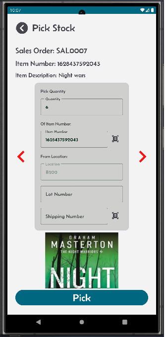

[← Back](README.md)

# Allocation and Picking Process  

Allocation generates picking work to streamline order fulfillment. Follow these steps to begin:

### Navigate to the Picking Screen  
- Click on "Pick Stock" from the main screen.
- Select the sales order you want to pick.
- Picking Options

### The picking process in Mini-WMS offers flexibility to suit different scenarios:
- Pick full quantity: Fulfill the entire order line in one operation.
- Pick partial quantity: Pick part of the order and defer the rest for later.
- Short pick: Record a short pick for the sales order line, either as a zero pick or a partial pick.

### Advanced Features
Mini-WMS supports advanced picking options for enhanced traceability and accuracy:
- Lot control: Pick stock based on lot numbers.
- Serial number tracking: Ensure precise tracking of serialized inventory.

### Container Options
- You can pick the entire order into a single container, or distribute it across multiple containers as needed.
- This flexibility ensures accurate and efficient order fulfillment, tailored to your warehouse operations.

<table>
  <tr>
    <td style="width: 50%; text-align: left;">Step 1: PO ready for picking</td>
    <td style="width: 50%; text-align: left;">Step 2: Picking from a location. If the item is lot control, you have to provide lot control.</td>
  </tr>
  <tr>
    <td style="vertical-align: top;">
      
    </td>
    <td style="vertical-align: top;">
      
    </td>
  </tr>
  <tr>
    <td style="width: 50%; text-align: left;">You can pick some and some later. Or short pick some quantities or zero pick all.</td>
    <td style="width: 50%; text-align: left;">If the item is serial number control, then you have to enter a serial number for every each.</td>
  </tr>
  <tr>
    <td style="vertical-align: top;">
      
    </td>
    <td style="vertical-align: top;">
      
    </td>
  </tr>
