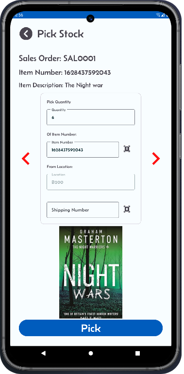

[← Back](README.md)

# Picking Process  

Allocation generates picking work to streamline order fulfillment. Follow these steps to begin:

### Navigate to the Picking Screen  
- Click on "Pick Stock" from the main screen.
- Select the sales order you want to pick.
- Picking Options

### The picking process in Mini-WMS offers flexibility to suit different scenarios:
- Pick full quantity: Fulfill the entire order line in one operation.
- Pick partial quantity: Pick part of the order and defer the rest for later.
- Short pick: Record a short pick for the sales order line, either as a zero pick or a partial pick.

### Advanced Features
Mini-WMS supports advanced picking options for enhanced traceability and accuracy:
- Lot control: Pick stock based on lot numbers.
- Serial number tracking: Ensure precise tracking of serialized inventory.

### Container Options
- You can pick the entire order into a single container, or distribute it across multiple containers as needed.
- This flexibility ensures accurate and efficient order fulfillment, tailored to your warehouse operations.

### Step 1: Make sure an order is allocated.  
  

---

### Step 1: From main screen, click on the 'Pick Stock' button.  
  

---

### Step 1: Sales Order is ready for picking  
You should see your SO in the dropdown.
  

---

### Step 2: Picking from a location  
If the item is lot controlled, you have to provide a lot number.  
  

---

### Picking Options  
You can pick the whole quantity at once, or part of it and leave the rest for later. You can also short pick some or all of it.    
  

---

### Short picking  
You can short pick some or all of it.  
> ⚠️ If the item is **lot controlled** and you want to short pick, you **must enter zero** in the quantity field.  
  

---

### Picking a serial number controlled item.  
Some stock can be serial number controlled like Phones/Laptops ...etc.    
  

---
### Serial Number Controlled imput screen  
If the item is serial number controlled, then you must enter a serial number for **each item**.  
  

