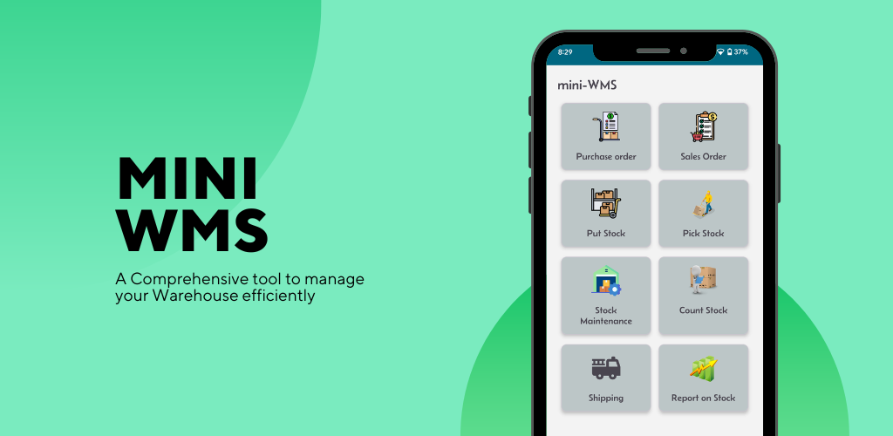

[View Issues List](https://github.com/miniwms/Mini-WMS/issues)  |  [Add New Issue](https://github.com/miniwms/Mini-WMS/issues/new?assignees=&labels=&template=&title=)  

# Mini Warehouse Management System

**A tool to streamline your mini warehouse.**

This is a comprehensive app designed to streamline and optimize various aspects of mini warehouse operations.  

Whether you're a high-volume seller on **Amazon**, **eBay** or **Shopify** platforms, or you manage a business dealing with large stock quantities and reselling them through sales orders, this app is for you.  

This app will increase your productivity and stock accuracy, speeding up the **receiving**, **picking**, and **shipping** processes.

---

[Setup/Configure your mini warehouse](miniWMSConfiguration.md).  
[Purchase order setup](purchaseOrders.md).  
[Receiving Process](Receiving.md).  
[Sales Order setup](salesOrders.md).  
[Sales Orders Import](salesOrdersDownload.md).  
[Shopy / Amazon / Ebay API access](ShopifyAmazonEbayApi.md).  
[Sales Order Allocation](salesOrderAllocation.md)  
[Picking Process](Picking.md).  
[Stock count Process](stockCount.md).  
[Shipping container](shippingContainer.md).  
[Reports](reports.md).  

## **Key Features**
- Organize your stock by setting up rows of bin-locations and marking them with location labels (e.g., `A1-13`).
- Automate the process of managing purchase orders, receiving/putaway, and sales order fulfillment.
- Get an accurate picture of your stock at any time.

### **Operations Included**
1. **Purchase Order Manual Entry**  
2. **Uploading Purchase Orders List**  
3. **Receiving & Putaway Stock**  
4. **Sales Order Manual Entry**  
5. **Uploading Sales Orders List**  
6. **Allocate Sales Orders** (Generate pick lists)  
7. **Automatic Picking Process** (into shipping containers)  
8. **Shipping Container Weight and Tracking** (for carriers)  
9. **Stock Count / Cycle Count / Inventory Control**  
10. **Fully Configurable System** (via setup screen)  
11. **Bin-location Setup**  
12. **Maximum Capacity Calculation** (for stock in a location)  
13. **Storage and Pick Strategies Configuration**  
14. **Barcode Scanning** or manual entry of product numbers  
15. **Item Details with Pictures**  
16. **Minimum Stock Level Warning**  
17. **Expiry Date Management** and reporting on expired products  
18. **FIFO Stock Rotation**  
19. **Multiple Themes and Colors**  
20. **Night Mode**  
21. **Multilingual Support** (English, Chinese, French, Spanish, Russian, Malay, etc.)  
22. **Data Visualization** with reports  
23. **Export and Import Tools**  
    - For regular backups or switching devices.

---

## **Why Choose This App?**
- **Standalone**: Does not require an internet connection.  
- **Self-contained**: No need for a complex back-end WMS application.  
- **Device-based**: All functionalities reside on your Android device.  
- **No Login Required**: Simple to use on your personal device.  

Enjoy the functionalities of a high-end WMS application in the palm of your hand!

---

## **Setup Instructions**
1. **Set Up Bin Locations**  
    Example:  
    A0-01, A0-02 to A0-09, etc.  
    A1-01, A1-02 to A1-09, etc.  
    ...  
    B0-01, B0-02 to B0-09, etc.  
    B1-01, B1-02 to B1-09, etc.  

2. **Set Up Location Groups**  
3. **Set Up Item Types**  
4. **Set Up Items/Products** (including pictures)  
5. **Configure Storage Strategies**  
    - Direct stock to predefined bin-locations after receiving.  
6. **Configure Picking Strategies**  
    - Automatically pick sales orders from predefined bin-locations and build shipping containers.  
7. **Set Up Stock Locations**  
8. **Set Up Vendors**  
9. **Upload Purchase Orders**  
    - Receive and put away.  
10. **Upload Sales Orders**  
    - Allocate and pick into containers.  

---

Transform your warehouse management experience with this powerful app!

