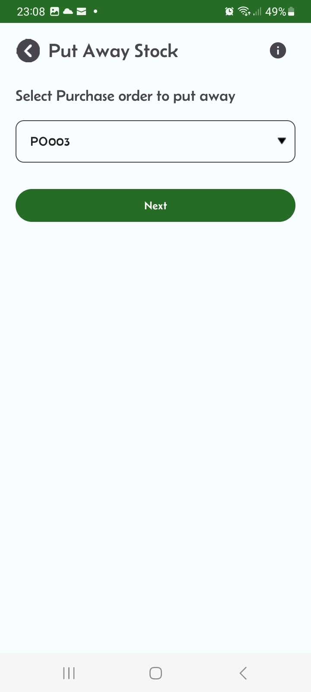
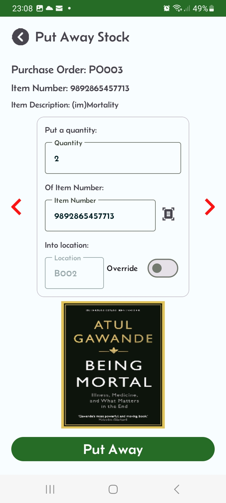
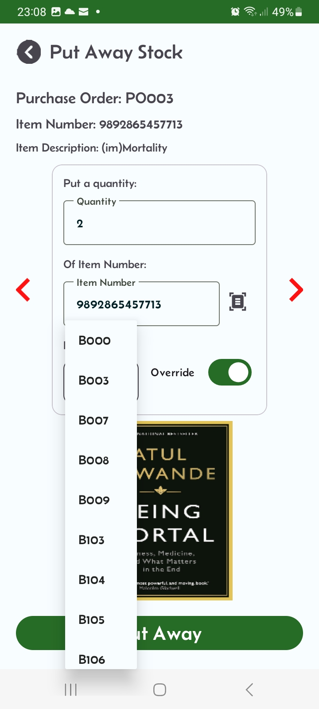

# Receiving Process

  The receiving process involves the following steps:
  
  Upload purchase orders through the import button.
  Or manually add an order via the purchase order screen by clicking the purchase order button from the Home screen.
  On the Purchase Order screen, click the Receive button.
  
  This will generate put away work for this PO. Navigate to the "Put Away Stock" screen by clicking the "Put Stock" button from the home screen.
  
  Back to Customer Portal</a>

  
## Step 1: PO ready to put away in your warehouse locations
||Verify your purchase order is in the dropdown list.|
|:---|---:|

## Step 2: Put away to the system generated location.
|| The Mini-WMS app will direct you to the system generated location. Place the stock quantity shown in the location shown, then click "Put Away" button.|
|:---|:---:|

## Step 3: Override to an other location
|| Click the Override toggle switch. This will show a dropdown with possible alternative location where you can store your stock. This alternative locations are chosen based on the storage strategy of the item.|
|:---|:---:|
