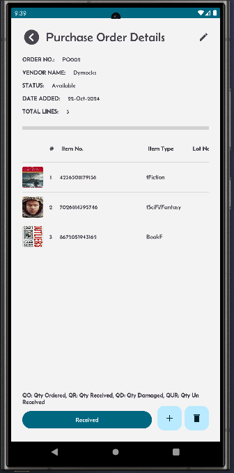
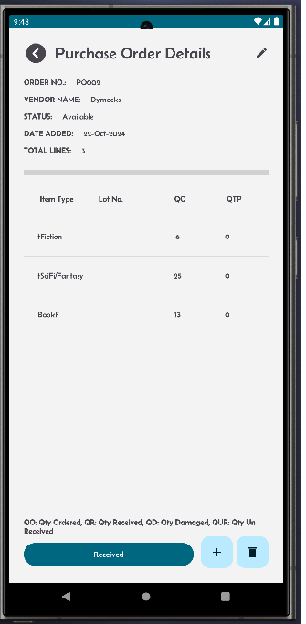
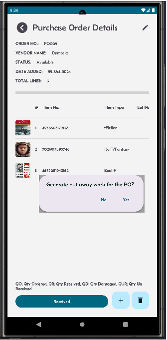
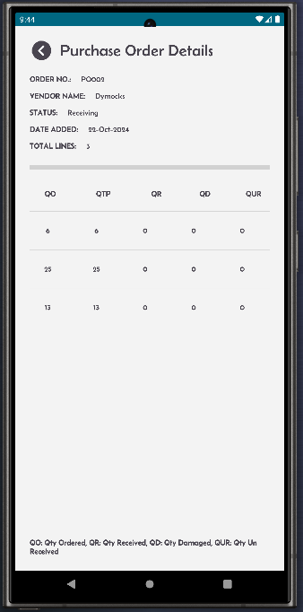
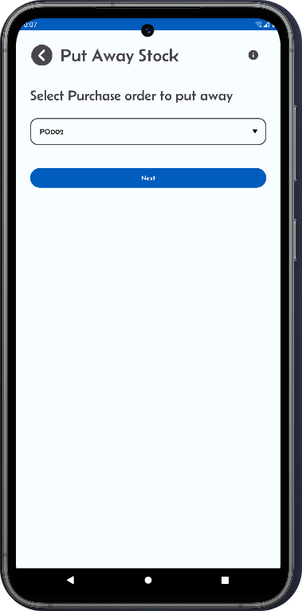
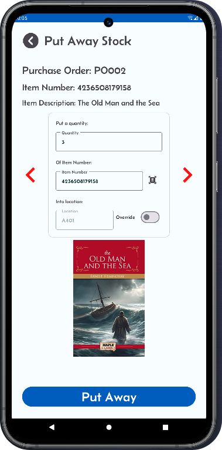
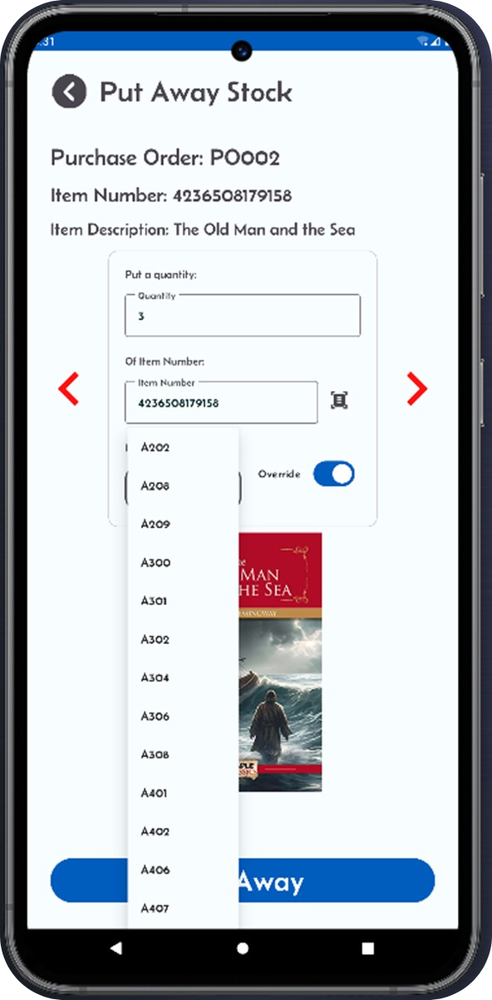

[← Back](README.md)

<h1>Receiving Process</h1>

The receiving process involves the following steps:

<ul>
  <li>Navigate to a single purchase order screen view screen. By clicking the Receive button you will initiate the receiving process.</li>
  <li>This process will generate put away work for all the items on this purchase order.</li>
</ul>

Navigate to the "Put Away Stock" screen by clicking the "Put Stock" button from the home screen.

<h2>Receiving Process</h2>
<table style="width: 100%; border-collapse: collapse;">
  <tr>
    <!-- Column 1 -->
    <td style="width: 33%; text-align: center; vertical-align: top;">
      
<strong>Step 1: Check purchase order details. The PO is at status Available.</strong>

      
    </td>
    <!-- Column 2 -->
    <td style="width: 33%; text-align: center; vertical-align: top;">
      
<strong>Step 2: Check the quantity too.</strong>

      
    </td>
    <!-- Column 3 -->
    <td style="width: 33%; text-align: center; vertical-align: top;">
      
<strong>Step 3: Click receive button to generate put away work.</strong>

      
If not all quantities can be received, then the Receive button will still be visible. You can then replenish stock and come back here and click the button again to fully receive the PO.

      
    </td>
  </tr>
  <tr>
    <!-- Column 1 -->
    <td style="width: 33%; text-align: center; vertical-align: top;">
      
<strong>Step 4: PO is ready to put away.</strong> You can see the status has changed to Receiving.

      
You can verify that the quantity to put is now equal to the quantity ordered.

      
    </td>
    <!-- Column 2 -->
    <td style="width: 33%; text-align: center; vertical-align: top;">
    </td>
    <!-- Column 3 -->
    <td style="width: 33%; text-align: center; vertical-align: top;">
    </td>
  </tr>
  <tr>
    <!-- Column 1 -->
    <td style="width: 33%; text-align: center; vertical-align: top;">
      <strong>Step 5: PO ready to put away</strong>
      
Verify your purchase order is in the dropdown list.

      
    </td>
    <!-- Column 2 -->
    <td style="width: 33%; text-align: center; vertical-align: top;">
      <strong>Step 6: Put away to system location</strong>
      
The Mini-WMS app directs you to the system-generated location. Place the stock and click "Put Away".

      
    </td>
    <!-- Column 3 -->
    <td style="width: 33%; text-align: center; vertical-align: top;">
      <strong>Step 7: Override to another location</strong>
      
Click the Override toggle switch to select an alternative location based on the storage strategy.

      
    </td>
  </tr>
</table>

