[← Back](README.md)

<h1>Receive and Putaway Process</h1>

The receiving process involves the following steps:

<ul>
  <li>From home screen, click on the Purchase order button.</li>
  <li>Navigate to a single purchase order view screen.</li>
  <li>By clicking the Receive button you will initiate the receiving process.</li>
  <li>This process will generate put away work for all the items on this purchase order.</li>
  <li>'On the purchase Order Details' screen slide to the left, you should see the 'Quantity To Put' column populated. This shows work was indeed generated.</li>
  <li>Also you will notice the 'Receive' button is not available any more, as there is no need for it.</li>
  <li>This process can putaway with lot numbers if the item is set for lot control.</li>
  <li>It also allows you to override the putaway to a different location other than the proposed location.</li>
</ul>

To action the putaway work, you need to navigate to the "Put Away Stock" screen by clicking the "Put Stock" button from the home screen.

<h2>Receiving Process</h2>
<table>
  <tr>
    <th align="left"><strong>Step 1:</strong> Click on the 'Purchase Order' button.</th>
    <th align="left"><strong>Step 2:</strong> On the result screen tap on a single PO to check the purchase order details. The PO is at status Available.</th>
    <th align="left"><strong>Step 3:</strong> Check the quantities ordered</th>
  </tr>
  <tr>
    <td style="vertical-align: top;">
      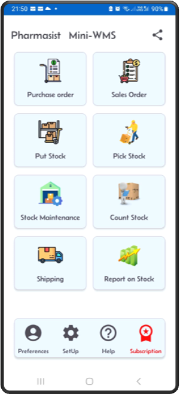
    </td>
    <td style="vertical-align: top;">
      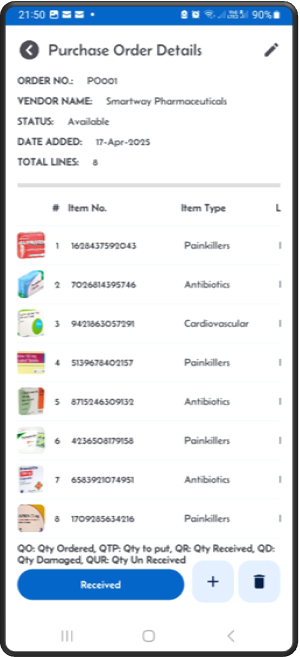
    </td>
    <td style="vertical-align: top;">
      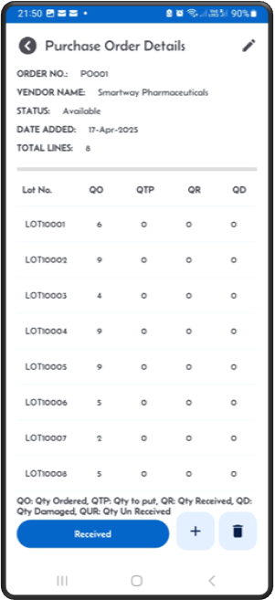
    </td>
  </tr>
  <tr>
    <th align="left"><strong>Step 4:</strong> Click the 'Receive' button to generate put away work.</th>
    <th align="left">The PO is ready to put away.</strong> You can see the status has changed to Receiving. You can also verify that the quantity to put is now equal to the quantity ordered. On the Purchase Order Detail screen, slide to the left and check the quantoties.</th>
    <th align="left">Navigate to the 'Stock Results' screen.</th>
  </tr>
  <tr>
    <td style="vertical-align: top;">
      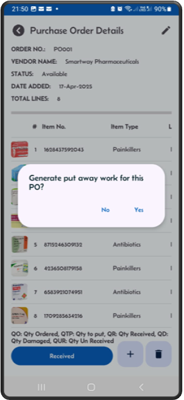
    </td>
    <td style="vertical-align: top;">
      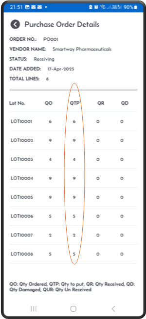
    </td>
    <td style="vertical-align: top;">
      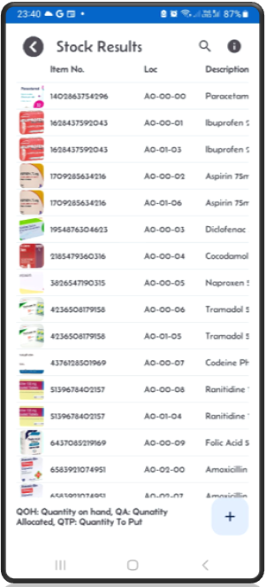
    </td>
  </tr>
  <tr>
    <th align="left">Check that the itemloc has incoming expected stock in the 'QTP', quantity to put column.</th>
    <th align="left"><strong>Step 5: Your Purchase Order is ready to put away</strong> In the 'Put Away Stock' screen, verify it is in the dropdown list. Then click Next.</th>
    <th align="left"><strong>Step 6: Put away to a location. The Mini-WMS app directs you to the system-generated location. Put the stoc in the shown location and click the "Put Away" button.</th>
  </tr>
  <tr>
    <td style="vertical-align: top;">
      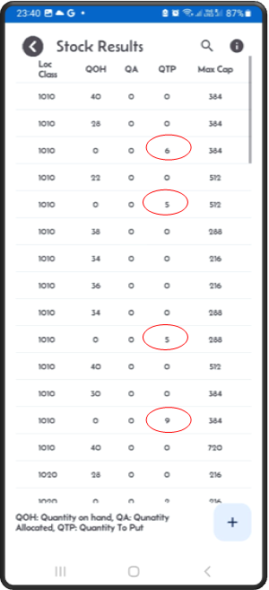
    </td>
    <td style="vertical-align: top;">
      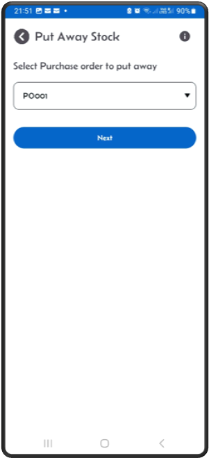
    </td>
    <td style="vertical-align: top;">
      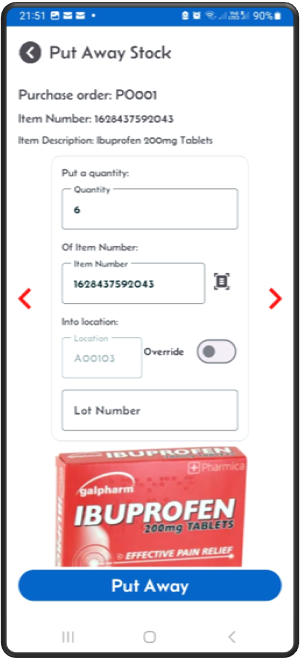
    </td>
  </tr>
    <tr>
    <th align="left"><strong>Step 7: Override to another location: Click the Override toggle switch to select an alternative location based on the storage strategy.</th>
    <th align="left">If you receive the full quantity, the system will prompt you for the second putaway. Otherwise, if you try to put less than the full quantity, a popup shows up asking you if you want to put the reset later orshort pick the rest.</th>
    <th align="left"></th>
  </tr>
  <tr>
    <td style="vertical-align: top;">
      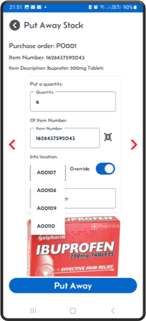
    </td>
    <td style="vertical-align: top;">
      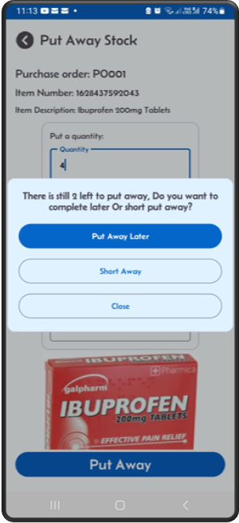
    </td>
    <td style="vertical-align: top;">
    </td>
  </tr>
</table>
