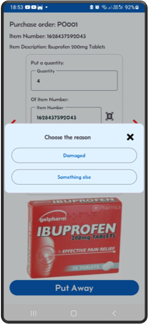
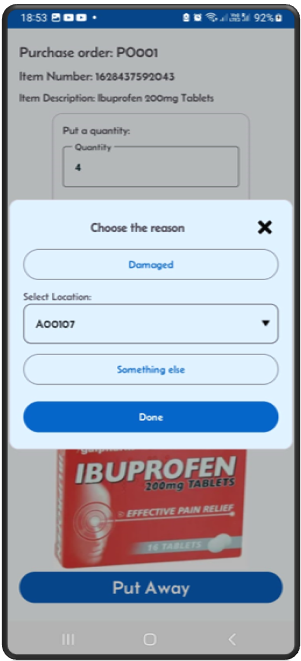
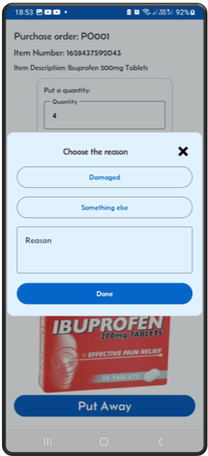

[← Back](README.md)

# Receive and Putaway Process

The receiving process involves the following steps:

- From home screen, click on the Purchase order button.
- Navigate to a single purchase order view screen.
- By clicking the Receive button you will initiate the receiving process.
- This process will generate put away work for all the items on this purchase order.
- 'On the purchase Order Details' screen slide to the left, you should see the 'Quantity To Put' column populated. This shows work was indeed generated.
- Also you will notice the 'Receive' button is not available any more, as there is no need for it.
- This process can putaway with lot numbers if the item is set for lot control.
- It also allows you to override the putaway to a different location other than the proposed location.

To action the putaway work, you need to navigate to the "Put Away Stock" screen by clicking the "Put Stock" button from the home screen.

---

## Step 1: Click on the 'Purchase Order' button  

---

## Step 2: On the result screen, tap on a single PO to check the purchase order details  
The PO is at status **Available**.  

---

## Step 3: Check the quantities ordered  

---

## Step 4: Click the 'Receive' button to generate put away work  

---

## Step 5: The PO is ready to put away  
You can see the status has changed to **Receiving**. You can also verify that the quantity to put is now equal to the quantity ordered.  
On the Purchase Order Detail screen, slide to the left and check the quantities.  

---

## Step 6: Navigate to the 'Stock Results' screen  

---

## Step 7: Check Quantity to put:  
that the item location (itemloc) has incoming expected stock in the 'QTP' (Quantity to Put) column

---

## Step 8: Your Purchase Order is ready to put away  
In the 'Put Away Stock' screen, verify it is in the dropdown list. Then click **Next**.  

---

## Step 9: Put away to a location  
The Mini-WMS app directs you to the system-generated location.  
Put the stock in the shown location and click the **"Put Away"** button.  

---

## Step 10: Override to another location (optional)  
Click the **Override** toggle switch to select an alternative location based on the storage strategy.  

---

## Step 11: If you receive the full quantity  
The system will prompt you for the second putaway.  
Otherwise, if you try to put less than the full quantity, a popup shows up asking if you want to put the rest later or short pick the rest.  

---

## Step 12: If you choose to put away later  
The rest will be left for later picking. If you choose to **Short pick**, then a new popup will show up.  

---

## Step 13: If you click 'Damaged'  
You need to select from the dropdown locations where to put the damaged quantity.  

---

## Step 14: If you click 'Something else'  
You need to enter the reason. Example: "stock will be returned", etc.  

