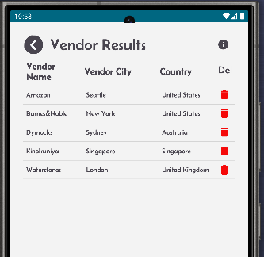
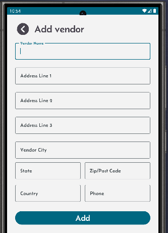
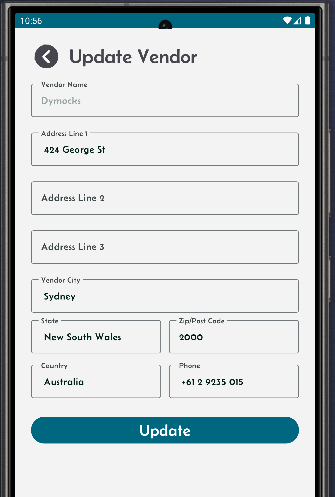

# Configure Vendors for purchase orders.

In a Warehouse Management System (WMS), vendor details are essential for managing purchase orders effectively and ensuring stock traceability.

Click on the Vendor button to 
- View existing vendors.
- Add new vendors.
- Update or delete existing vendors.  

<table>
  <tr>
    <th>List of vendors on the result screen.</th>
    <th>Screen to add new vendor.</th>
    <th>Screen to update existing vendor.</th>
  </tr>
  <tr>
    <td style="vertical-align: top;">
      
    </td>
    <td style="vertical-align: top;">
      
    </td>
    <td style="vertical-align: top;">
      
    </td>
  </tr>
</table>
