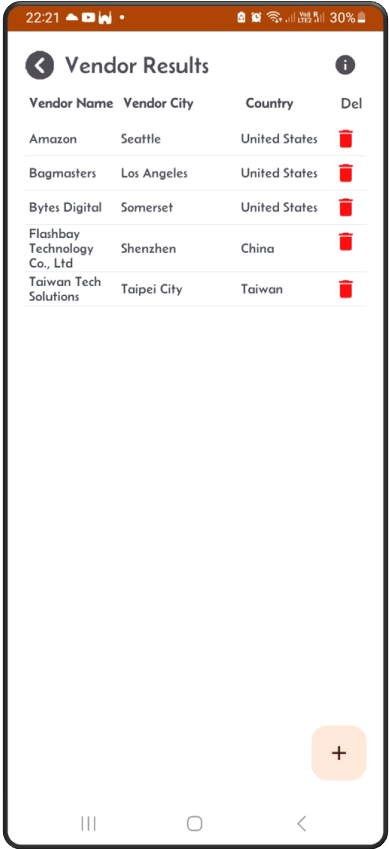

[← Back](miniWMSConfiguration.md)

# Configure Vendors for purchase orders.

In a Warehouse Management System (WMS), vendor details are essential for managing purchase orders effectively and ensuring stock traceability.

Click on the Vendor button to 
- View existing vendors.
- Add new vendors.
- Update or delete existing vendors.  

### Vendor List  
This screen shows a list of vendors.  

  

---

### Update Existing Vendor  
Click on one of the lines in the vendor list. The update screen will appear, allowing you to modify the details of the selected vendor.  

  

---

### Add New Vendor  
From the vendor list screen, click on the '+' sign to add new vendor. This screen below will appear.  

  

