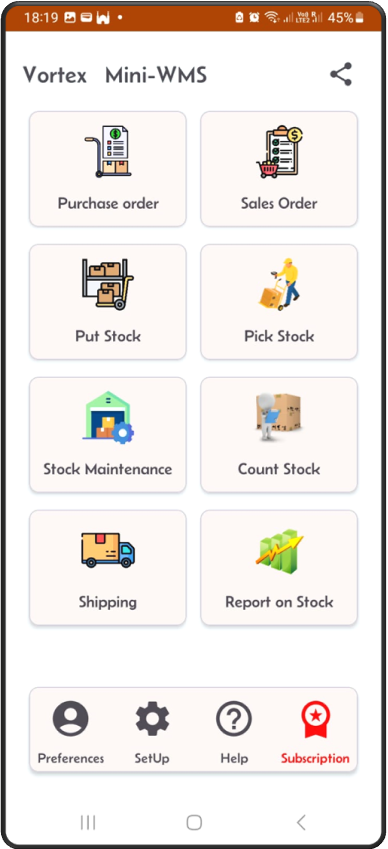
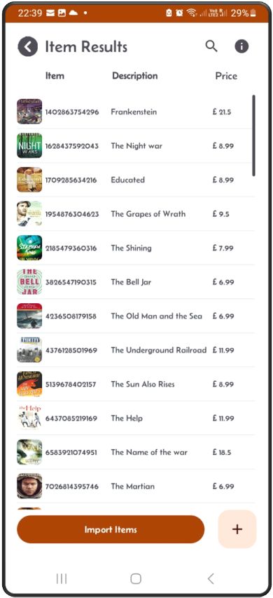
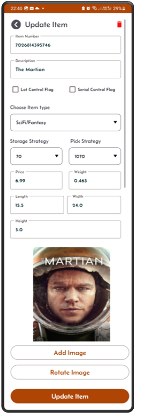

[← Back](miniWMSConfiguration.md)

# Configure item types and items/SKUs

Item types and SKUs (Stock Keeping Units) are critical elements in a Warehouse Management System (WMS). Properly defining these ensures efficient warehouse operations and seamless inventory management.

By setting up item types and SKUs effectively, your warehouse operations become more organized and efficient, resulting in reduced errors, faster processing times, and improved inventory control.

SKUs are unique identifiers assigned to each individual item or product. SKUs are essential for:

- Inventory Tracking.
- Order Fulfillment.
  
Click on the item type button to setup item types.  
Click on the Item button to setup the items/SKUs

The item number can be your barcode number (you can scan it) or contains alphanumerical values.

### From main menu click on the SetUp button  


---

### From the SetUp screen click on the Item button  


---

### The Item results screen appears  
From this screen you can add new item, also you can upload a list of items in excel spreadsheet using the 'Import Items' button.


---

### Item Edit  
Tap on an item in the list to view and edit its details.  


---

### Item Add  
From the Item Results screen, click on the '+' sign to add new item to your stock. You can also add or update an item's image using the picture input section.  


The item/SKU can be imported via excel spreadsheet.  
The format of the sheet is shown below.

```
The spreadsheet columns should contain the first row as column names then next rows the items details, as shown below:

itemNumber       description          storageStrategy  pickStrategy  itemType  warningLevel  price    weight  length  width  height
1102863754776    Educated              20              1020          BookF        3          8.99      0.741  15      22      2.5
1102863754886    The Shining           70              1070          BookSF       3          9.5       1.041  16      23      3
1102863754996    The Grapes of Wrath   20              1020          BookF        3          7.99      0.654  12      18      2.8

and so on...

```
