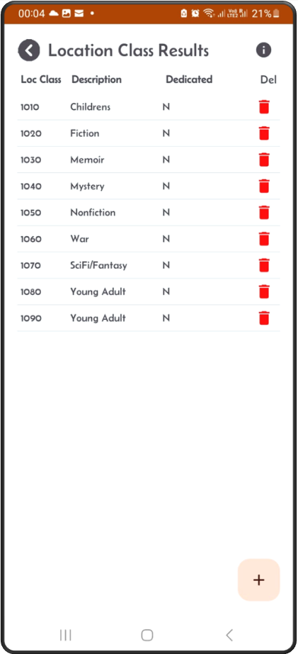
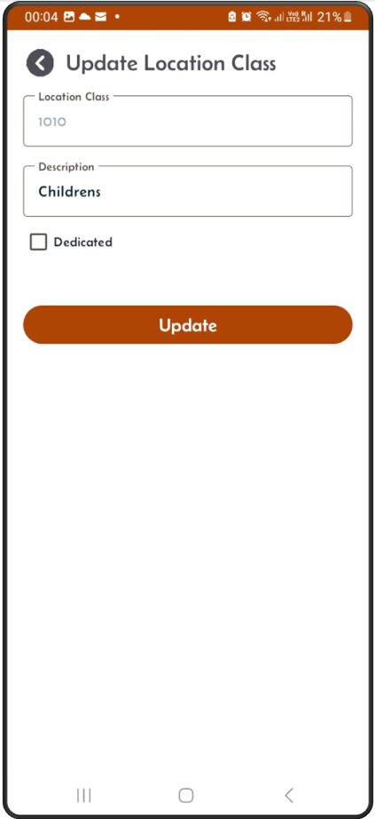
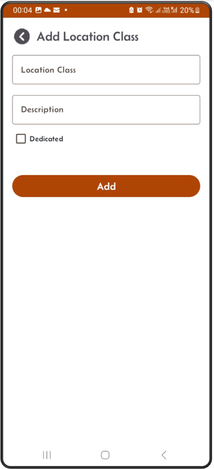

[← Back](miniWMSConfiguration.md)

# Location classes or location groups

Location classes are a way to categorize or group multiple storage locations within a warehouse based on shared characteristics.

Each location class can represent a group of bins or shelves that share common attributes, such as:

- **Storage Type**: Grouping locations based on the type of items they store, like computers, computer accessories, heavy goods, small parts, or hazardous materials.
- **Accessibility**: Classifying locations by how easily they can be accessed, e.g., prime locations for fast-moving items.
- **Temperature Control**: Designating areas for climate-controlled goods (e.g., refrigerated locations).
- **Load Capacity**: Differentiating locations that can bear certain weight limits.

### From the main menu 
click the SetUp button, then on the SetUp screen click on the location class button  

---

### The location class result screen  
You add new entries by clicking on the '+' sign. Also, you can delete an entry by clicking on the bin button on the right.

---

### Update screen  
Tap on one entry from the result list, the update screen appears enabling you to update the record.

---

### Add screen  
From the results screen, click on the '+' sign, the Add screen will appear.

---

- Click the Location class button, the next screen will display the list of existing location classes in order of location class numbers.
- You can add new location class by using the + button from the location class result screen.
- Specify if the new location class is dedicated or not. This will make sure that any location in this location class will be dedicated. If itemloc is dedicated and the stock goes to zero the itemloc will be NOT be deleted from the system. Otherwise, if this dedicate flag if off, then if stock goes to zero then the itemloc does get deleted from the system and the location is made available again by setting it's empty flag to 'Y'.
- You can delete location class by using the bin button on the result screen.
- If the location class is used by locations, then you cannot delete it. You need to disassociate locations from this location class prior to delet.
- **Dedicate/Un-dedicate**:  
    If you would like to dedicate all locations for a location class, tick that box and click update.  
    If you would like to un-dedicate all locations for a location class, un-tick that box and click update.  
  

## Location Class Fields:

- **Location class**: Numeric value.
- **Location class Description**: Description.
- **Dedicate flag**: Flag used to dedicate a location to an item.

