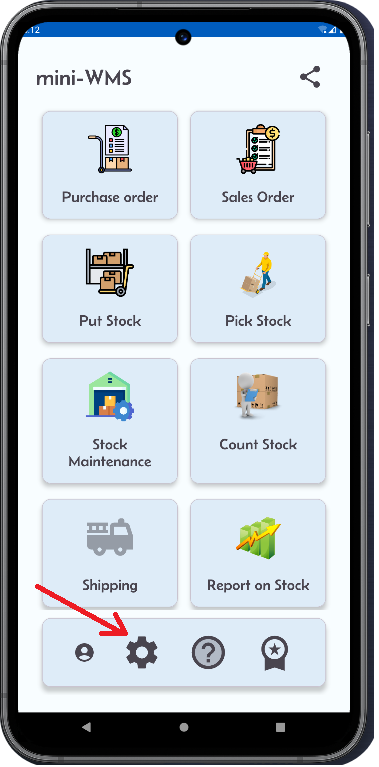
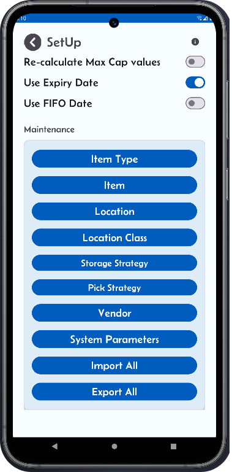

<h1>Configure locations</h1>

The initial configuration involves the following steps:

<ul>
  <li>This screen displays the list of existing locations in alphabetical order.</li>
  <li>You can add new locations by using the + button. To do so, enter the starting and ending locations in the format: start location A101 and end location A210 and a location class. A1 and A2 represent the storage locations row, 01 and 10 represents the location positions along the rows.</li>
  <li>This will generate 20 physical locations belonging to a single location class. You can repeat the same process to generate other sets of locations with different location class.</li>
  <li>If your storage setup has more than 10 rows, e.g. 25 rows and 15 columns, then you can do the following: Click the + button, starting location A001, ending location B915. This should generate in the mini-WMS app 300 locations. Then click the add button again with starting location C001 ending location C415, this should give you another 75 locations. So altogether 375 locations.</li>
  <li>You can delete locations by using the bin button. Enter the start and end location to complete the delete.</li>
  <li>You can also import locations from an excel spreadsheet. Use "import locations" button.</li>
</ul>

The spreadsheet columns should contain the first row as column names then next rows the location details:

location  loc_class  empty_flg  length  width  height

A101      100        Y          50      30     40

A102      100        Y          50      30     40

A103      100        Y          50      30     40

and so on...

length, width and height are in centimeters.

<h2 style="color: #009688;">Location Fields:</h2>
<ul>
  <li><strong>Location</strong>: Location name.</li>
  <li><strong>Empty flag</strong>: If set to Yes, the location is empty, otherwise stock exist in it.</li>
  <li><strong>Location class</strong>: Identifier that groups a set of physical locations.</li>
  <li><strong>Length</strong>: Length of the location.</li>
  <li><strong>Width</strong>: Width of the location.</li>
  <li><strong>Height</strong>: The height of the location.</li>
</ul>

<table style="width: 100%; border-collapse: collapse;">
  <tr>
    <!-- Column 1 -->
    <td style="width: 33%; text-align: right; vertical-align: top;">
      
    </td>
    <!-- Column 2 -->
    <td style="width: 33%; text-align: right; vertical-align: top;">
      
    </td>
  </tr>
</table>
