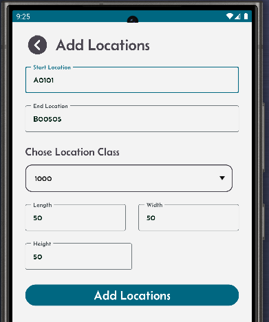

[← Back](miniWMSConfiguration.md)

# Configure locations

We have adopted the following location labelling system:

**AISLE - ROW - COLUMN**  
**A5 - 05 - 10**

- **A5** represents the **Aisle number**, indicating the specific section of the warehouse.
- **05** represents the **Row number**, referring to the horizontal line of storage within the aisle.
- **10** represents the **Column number**, identifying the vertical position or specific bin within the row.




- Click the Location button, the next screen will display the list of existing locations in alphabetical order.
- You can add new locations by using the + button from the locations result screen. To do so, enter the starting and ending locations in this format: starting location `A10000` and end location `A30505`. Enter a location class and length, width & height. `A1` and `A3` represent the Aisle number, the second two digits represent the rows, and the last two represent the column.
- This will generate 96 physical locations belonging to a single location class with identical dimensions. You can repeat the same process to generate other sets of locations with different location classes.
- This location labelling system will work whether you have one rack or multiple racks.
- You can delete locations by using the bin button. Enter the start and end locations to complete the delete.
- You can also import locations from an Excel spreadsheet using the "import locations" button.

The spreadsheet columns should contain the first row as column names, then the next rows the location details:

```
location  loc_class  empty_flg  length  width  height
A10101    100        Y          50      30     40
A10102    100        Y          50      30     40
A10103    100        Y          50      30     40
```

and so on...

Length, width, and height are in user-defined cm or inches.

## Location Fields:

- **Location**: Location name.
- **Empty flag**: If set to Yes, the location is empty; otherwise, stock exists in it.
- **Location class**: Identifier that groups a set of physical locations.
- **Length**: Length of the location.
- **Width**: Width of the location.
- **Height**: Height of the location.
