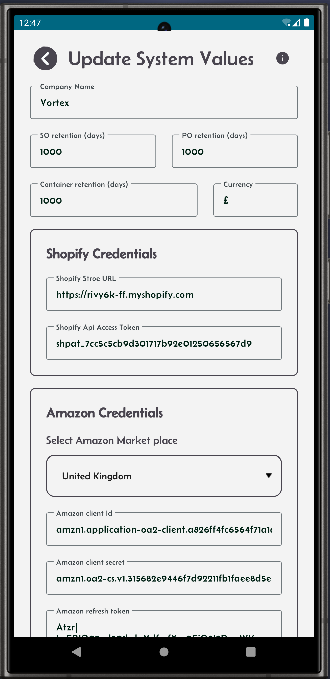
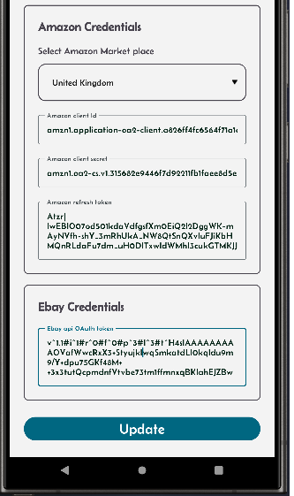

[← Back](miniWMSConfiguration.md)

# Configure System Parameters.

In a Warehouse Management System (WMS), some system wide parameters are essentials.

Click on the System Parameters button to setup the following: 
- Your company name in short which will display beside the home screen title. Not mandatory.
- The retention period in days for the purchase orders. If it is set to 20, it means that the system will delete all POs that are older than 20 days. Mandatory. 
- The retention period in days for the sales orders. If it is set to 20, it means that the system will delete all SOs that are older than 20 days. Mandatory. 
- The retention period in days for the shipping containers. If it is set to 20, it means that the system will delete all containers that are older than 20 days. Mandatory. 
The retention period parameters are used for data purging which helps to keep your data in manageable size and not grow continuously.

the other fields are:
- Shopify's credentials. This allows the Mini-WMS app to connect to your Shopify store and extract your open sales orders.
- Amazon's credentials. This allows the Mini-WMS app to connect to you Amazon store and extract your open sales orders.
- Ebay's credentials. This allows the Mini-WMS app to connect to you Ebay store and extract your open sales orders.
  
### System Parameters Screen  
This section shows the screen where the app’s system parameters are held and can be updated.

---

  

