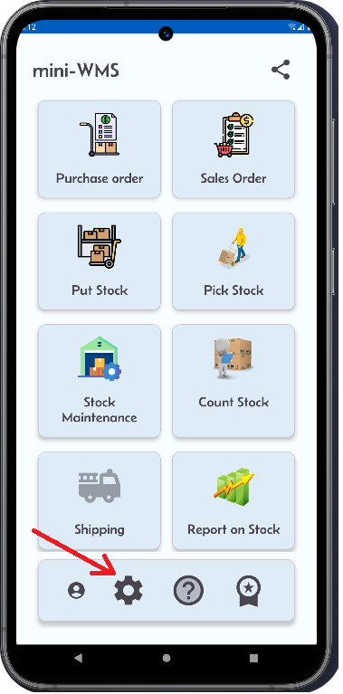

<h1>Mini-WMS Configuration</h1>

The initial configuration involves the following steps:

<table style="width: 100%; border-collapse: collapse;">
  <tr>
    <!-- Column 1 -->
    <td style="width: 33%; text-align: left; vertical-align: top;">
      <ul>
        <li>Setup item type.</li>
        <li>Seup the Items SKU and pictures.</li>
        <li>Setup the Bin locations.</li>
        <li>Setup the location group or location classes.</li>
        <li>Setup the Storage strategies.</li>
        <li>Setup the Pick strategies.</li>
        <li>Setup the purchase order vendors.</li>
        <li>Setup the System parameters.</li>
      </ul>
    </td>
    <!-- Column 2 -->
    <td style="width: 33%; text-align: right; vertical-align: top;">
      
    </td>
    <!-- Column 3 -->
    <td style="width: 33%; text-align: right; vertical-align: top;">
      
    </td>
  </tr>
</table>

Proper configuration of the above steps will streamline receiving, order allocation, and picking processes in your mini-warehouse, helping you maintain a high fulfillment rate and strong stock integrity.

<h2>Configuration</h2>
<table style="width: 100%; border-collapse: collapse;">
  <tr>
    <!-- Column 1 -->
    <td style="width: 33%; text-align: center; vertical-align: top;">
      <strong>Step 1: Add item/SKU types</strong>
      
Define the different item SKU types you have. The item type is a name given to a group of item. Example Computer, flat screens, hazardous, heavy ...etc 

      
      
    </td>
    <!-- Column 2 -->
    <td style="width: 33%; text-align: center; vertical-align: top;">
      <strong>Step 2: Setup the item types</strong>
      
Define the different item SKU types you have. The item type is a name given to a group of item. Example Computer, flat screens, hazardous, heavy ...etc 

      
    </td>
    <!-- Column 3 -->
    <td style="width: 33%; text-align: center; vertical-align: top;">
      <strong>Step 3: Override to another location</strong>
      
Click the Override toggle switch to select an alternative location based on the storage strategy.

      
    </td>
  </tr>
</table>
