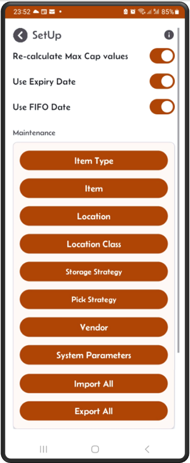

[← Back](README.md)

# Mini-WMS Configuration

The initial configuration involves the following steps:

- [Configure Bin locations](configureLocations.md)  
- [Configure location groups or location classes](configureLocationClasses.md)  
- [Configure Storage strategies](storageStrategy.md)
- [Configure Pick strategies](pickStrategy.md)
- [Configure item type and Items SKU and pictures](configureItems.md)
- [Setup the purchase order vendors](addVendors.md)
- [Setup the System parameters](configureSystemParameters.md)

Proper configuration of the above steps will streamline receiving, order allocation, and picking processes in your mini-warehouse.  
This will help you maintain a high fulfillment rate and strong stock integrity.

To get to the **SetUp** screen click on the SetUp button at the bottom.  

  

