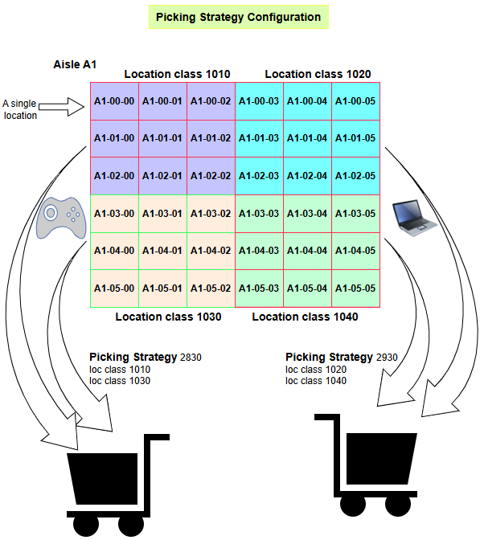

# Picking Strategy Configuration

Picking strategies are vital in optimizing the WMS order fulfillment process, especially when combined with organized storage strategies and location classes.

Effective picking ensures orders are fulfilled accurately and efficiently, minimizing delays and improving customer satisfaction.

Benefits of Picking Strategies:

- Streamline the picking process, ensuring faster and more accurate order fulfillment.
- Reduce unnecessary travel within the warehouse.
- Enhance worker productivity by guiding them through the optimal picking path.

