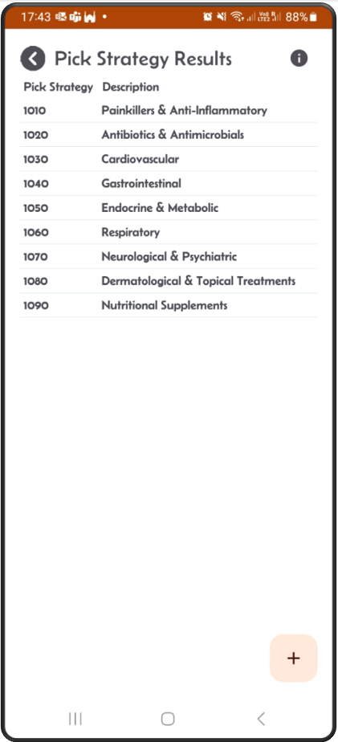
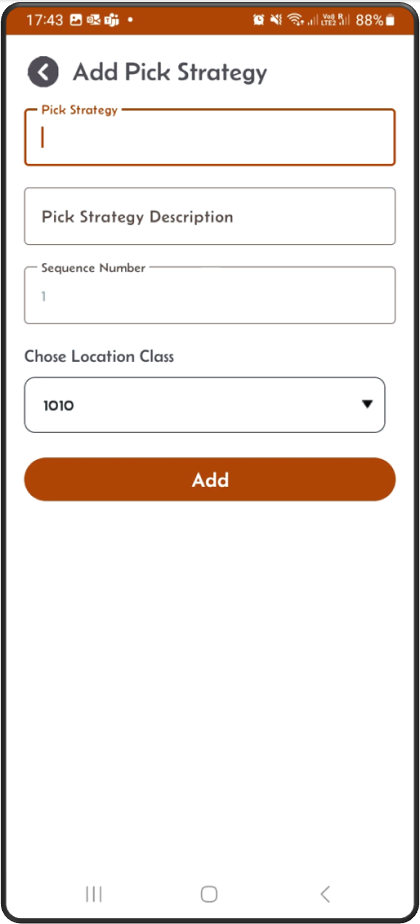
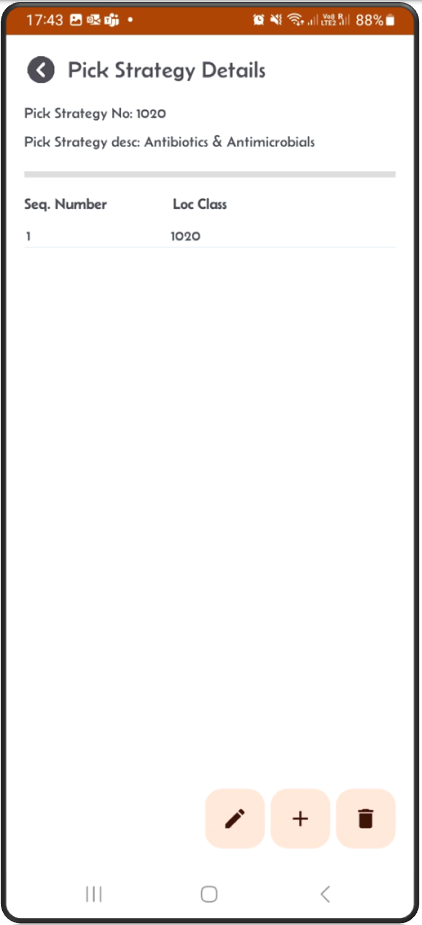
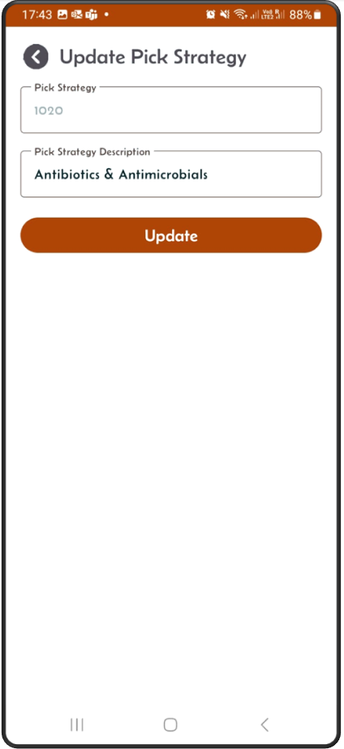
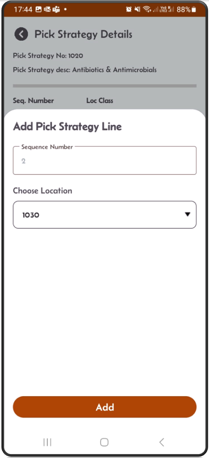
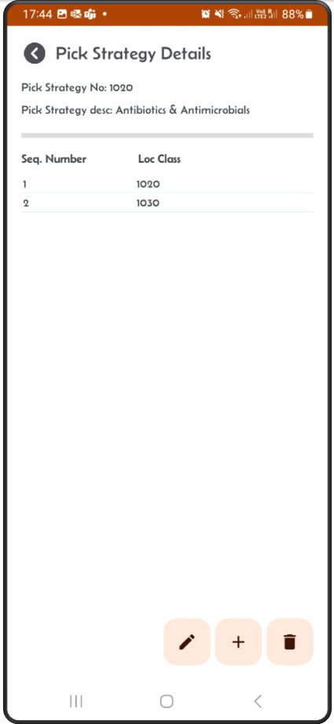
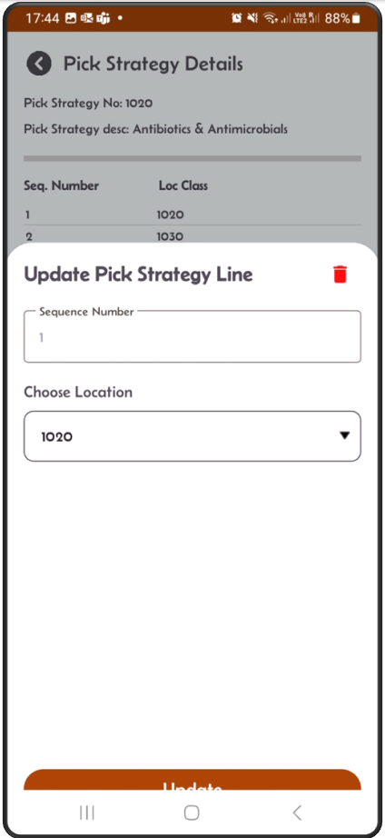

[← Back](miniWMSConfiguration.md)

# Picking Strategy Configuration

Picking strategies are vital in optimizing the WMS order fulfillment process, especially when combined with organized storage strategies and location classes.

Using pick strategies in the picking process, ensures orders are fulfilled accurately and efficiently, minimizing delays and improving customer satisfaction.

Benefits of Picking Strategies:

- Streamline the picking process, ensuring faster and more accurate order fulfillment.
- Reduce unnecessary travel within the warehouse.
- Enhance worker productivity by guiding them through the optimal picking path.

### Pick Strategy Workflow

---

**Step 1:** This is the pick strategy result screen.  

---

**Step 2:** Click the + button to add a new pick strategy.  
Add strategy number, description and location class details.  

---

**Step 3:** When you click **Add** button the new pick strategy will appear on the **Details** screen.  

---

**Step 4:** Click on the pen button to edit the pick strategy header information.  

---

**Step 5:** From the detail screen, click the + button to add a new location class detail.  

---

**Step 6:** The new location class will appear on the Details screen.  

---

**Step 5:** On the detail screen, click on an existing location class.  
You can either edit or click the red delete button to remove it.  

