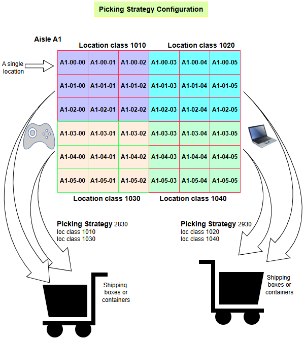

[← Back](miniWMSConfiguration.md)

# Picking Strategy Configuration

Picking strategies are vital in optimizing the WMS order fulfillment process, especially when combined with organized storage strategies and location classes.

Effective picking ensures orders are fulfilled accurately and efficiently, minimizing delays and improving customer satisfaction.

Benefits of Picking Strategies:

- Streamline the picking process, ensuring faster and more accurate order fulfillment.
- Reduce unnecessary travel within the warehouse.
- Enhance worker productivity by guiding them through the optimal picking path.

<table>
  <tr>
    <td style="width: 50%; text-align: left;">This is the pick strategy result screen.</td>
    <td style="width: 50%; text-align: left;">Click the + button and you should be able to add new pick strategy. Add description, Then the location class details.</td>
  </tr>
  <tr>
    <td style="vertical-align: top;">
      
    </td>
    <td style="vertical-align: top;">
      
    </td>
  </tr>
  <tr>
    <td style="width: 50%; text-align: left;">From the result screen, you can click on a record in the list which will take you to the pick strategy detail screen.</td>
    <td style="width: 50%; text-align: left;">Click on the pen button to edit the pick strategy header information.</td>
  </tr>
  <tr>
    <td style="vertical-align: top;">
      
    </td>
    <td style="vertical-align: top;">
      
    </td>
  </tr>
    <tr>
    <td style="width: 50%; text-align: left;">From the pick strategy detail screen, you can click on the + button, you should be able to add a new location class detail.</td>
    <td style="width: 50%; text-align: left;">From the pick strategy detail screen, you can click on an exising location class record to edit it. Also, you can click the red delete button to remove the location class.</td>
  </tr>
  <tr>
    <td style="vertical-align: top;">
      
    </td>
    <td style="vertical-align: top;">
      
    </td>
  </tr>
</table>

