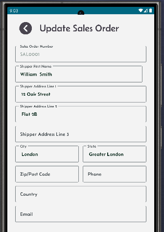
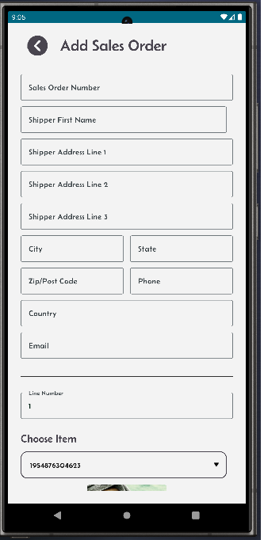
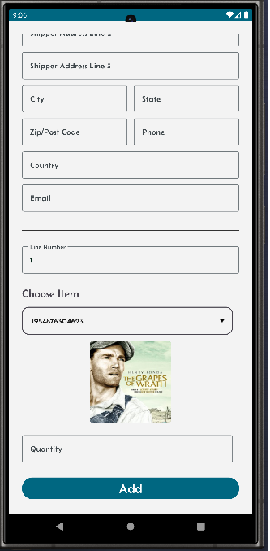

[← Back](README.md)

# Sales orders.

Purchase orders in your Mini-WMS can be added either manually or import via excel spreadsheet methodsvia the sales order screen.

**Excel Import**:  
- You need to fill in two sheets:  
  - One for purchase order headers.  
  - One for purchase order details.  

<table>
  <tr>
    <th>Click on the purchase Order button</th>
    <th>This requires credentials to access Shopify.</th>
    <th>Amazon and Ebay sites.</th>
  </tr>
  <tr>
    <td style="vertical-align: top;">
      
    </td>
    <td style="vertical-align: top;">
      
    </td>
    <td style="vertical-align: top;">
      
    </td>
  </tr>
  <tr>
    <th>List of sales orders screen.</th>
    <th>Single sales order detail screen showing header and detail lines.</th>
    <th>Update screen for a sales order.</th>
  </tr>
  <tr>
    <td style="vertical-align: top;">
      
    </td>
    <td style="vertical-align: top;">
      
    </td>
    <td style="vertical-align: top;">
      
    </td>
  </tr>
  <tr>
    <th colspan="2">Sales order add screen.</th>
  </tr>
  <tr>
    <td style="vertical-align: top;">
      
    </td>
    <td style="vertical-align: top;">
      
    </td>
  </tr>
</table>
