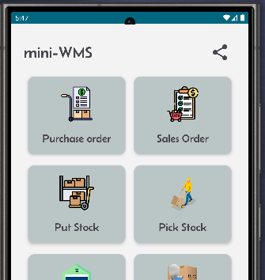
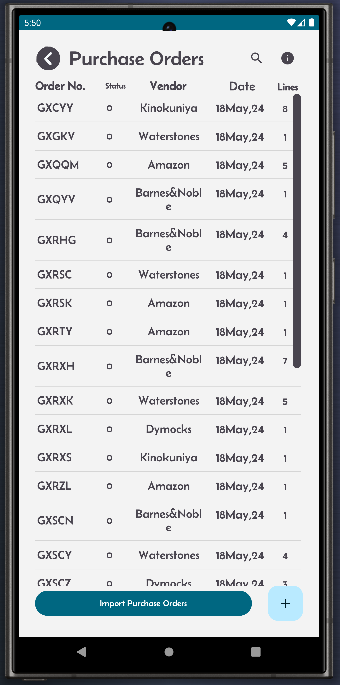
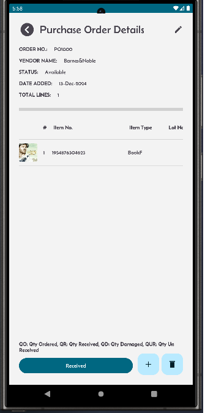
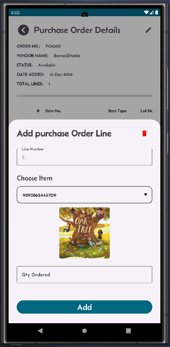

[← Back](README.md)

# Sales orders.

Purchase orders in your Mini-WMS can be added either manually or import via excel spreadsheet methods via the sales order screen.

**Excel Import**:  
- You need to fill in two sheets:  
  - One for purchase order headers.  
  - One for purchase order details.  

<table>
  <tr>
    <th>Click on the purchase Order button</th>
    <th>This screen displays a list of purchase orders.</th>
    <th>Click '+' to add new purchase order.</th>
  </tr>
  <tr>
    <td style="vertical-align: top;">
      
    </td>
    <td style="vertical-align: top;">
      
    </td>
    <td style="vertical-align: top;">
      
    </td>
  </tr>
  <tr>
    <th>After you click Add, the App shows the PO header and details.</th>
    <th>To add more PO lines, click the '+' sign .</th>
    <th></th>
  </tr>
  <tr>
    <td style="vertical-align: top;">
      
    </td>
    <td style="vertical-align: top;">
      
    </td>
    <td style="vertical-align: top;">
    </td>
  </tr>
</table>
