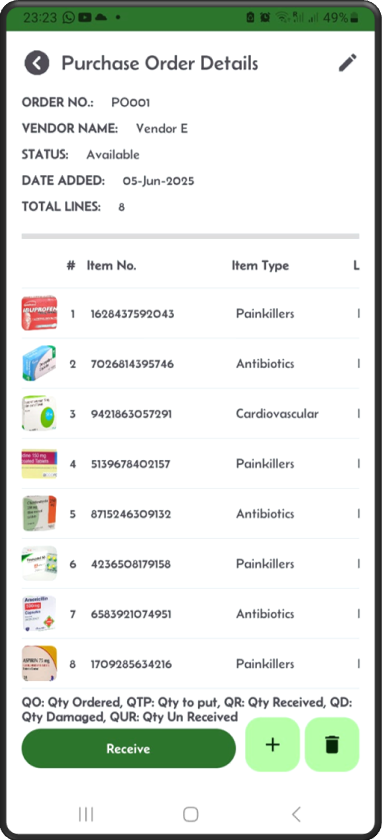
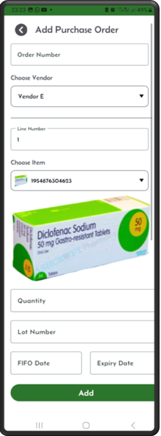
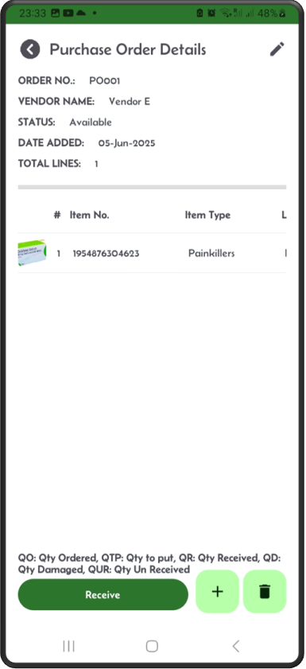
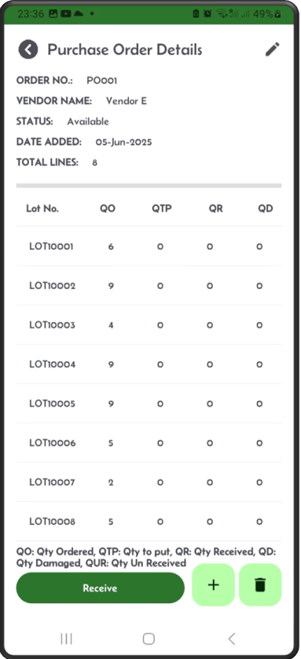

[← Back](README.md)

# Purchase orders.

Purchase orders in your Mini-WMS can be added either manually or via the import of excel spreadsheet methods in the purchase order screen.

The purchase order can be in one of the following statuses at any time: <br>The status goes from:<br>&nbsp;&nbsp;&nbsp;0 (available)<br>&nbsp;&nbsp;&nbsp;2  (in receiving) When receiving work exist<br>&nbsp;&nbsp;&nbsp;10 (Fully received and closed)

## Step 1: Click on the Purchase Order button  


---

## Step 2: This screen displays a list of purchase orders  


---

## Step 3: Click '+' to add new purchase order  
If the item is lot controlled, you should see a lot field on this screen.  


---

## Step 4: Scroll up the Add screen to populate the rest of the fields  
After adding the first item, you can add more items.  


---

## Step 5: After you click Add  
The App shows the PO header and details.  
To delete the purchase order, click the delete button.  


---

## Step 6: To add more PO lines  
Click the '+' sign.  
To delete the purchase order line, click the delete button.  


---

## Step 7: When looking at the purchase order result screen  
You can slide to the right to see more details.  


---

## Step 8: To the right of the screen, you can see  
The quantity ordered, quantity to put, and quantity received.  


---

## Step 9: By clicking on a single line  
The itemline screen shows up.  
If the item is lot controlled, then you should be able to see a lot number on the PO line item.  


    
**Import process: The format of the Excel file to Import**:  
- You need to fill in two sheets:  
  - One for purchase order headers.  
  - One for purchase order details.
    
To import purchase orders via excel, click on the "Import Purchase Orders" button and upload your Excel spreadsheet.
The spreadsheet should consist of two sheets: "purchaseorder" and "purchaseorderline". The import process will look for these sheet names with the exact spelling, it is case sensitive.
So, it needs to be written as they are. Below are the excel sheets and their columns.

The purchaseorder spreadsheet columns should contain the first row as the column names of the purchase order header fields, then, in the next rows the header information, as shown below:
In the case below we have shown 2 orders. You can have as many as you like.  

```
"purchaseorder"
po_number  vendor_number
POrder001  Amazon
POrder002  Waterstones
```

The purchaseorderline spreadsheet columns should contain the first row as the column names of the purchase order detail fields, then, in the next rows the details information, as shown below:  
You can see below, some items are lot controlled and some are not. Also, those item requiring expiry date, it has been set, otherwise the expiry date should be set to 2100-01-01 i.e. never expires. For the fifo date default is 2000-01-01.  

```
"purchaseorderline"
po_number   line_number   item_number     lot_num   fifo_date   expiry_date   qty_ordered  
POrder001   1             1628437592043   LOT1020   2000-01-01  2024-09-01    6  
POrder001   2             7026814395746             2000-01-01  2024-09-05    9  
POrder001   3             9421863057291   LOT1099   2000-01-01  2024-09-20    10  
POrder002   1             5139678402157             2000-01-01  2024-09-01    5  
POrder002   2             8715246309132   LOT1000   2000-01-01  2024-09-01    2  
```
