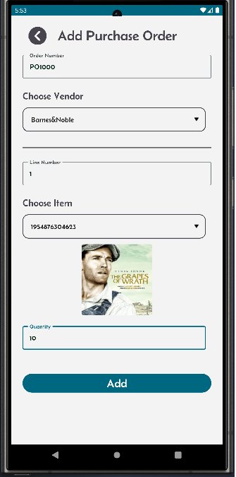

[← Back](README.md)

# Purchase orders.

Purchase orders in your Mini-WMS can be added either manually or import via excel spreadsheet methods via the sales order screen.

<table>
  <tr>
    <th>Click on the purchase Order button</th>
    <th>This screen displays a list of purchase orders.</th>
    <th>Click '+' to add new purchase order.</th>
  </tr>
  <tr>
    <td style="vertical-align: top;">
      
    </td>
    <td style="vertical-align: top;">
      
    </td>
    <td style="vertical-align: top;">
      
    </td>
  </tr>
  <tr>
    <th>After you click Add, the App shows the PO header and details. To delete the purchase order click the delete button.</th>
    <th>To add more PO lines, click the '+' sign. To delete the purchase order line click the delete button.</th>
    <th></th>
  </tr>
  <tr>
    <td style="vertical-align: top;">
      
    </td>
    <td style="vertical-align: top;">
      
    </td>
    <td style="vertical-align: top;">
    </td>
  </tr>
</table>

**Excel Import**:  
- You need to fill in two sheets:  
  - One for purchase order headers.  
  - One for purchase order details.
    
To import purchase orders via excel, click on the "Import Purchase Orders" button and upload your Excel spreadsheet.
The spreadsheet should consist of two sheets: "purchaseorder" and "purchaseorderline". The import process will look for these sheet names with the exact spelling.
So, it needs to be written as they are. Below are the excel sheets and their columns.

The purchaseorder spreadsheet columns should contain the first row as the column names of the purchase order header fields, then, in the next rows the header information, as shown below:
In this case we have shown 2 orders. You can have as many as you like.

```
"purchaseorder"
po_num      vendor_name
PO1111      Kinokuniya
PO1112      Waterstones
```

The purchaseorderline spreadsheet columns should contain the first row as the column names of the purchase order detail fields, then, in the next rows the details information, as shown below:

```
"purchaseorderline"
po_num      line_num        itm_num            qty_ordered
PO1111      1                1628437592043        6
PO1111      2                7026814395746        9
PO1111      3                9421863057291        4
PO1111      4                5139678402157        9
PO1111      5                8715246309132        9
PO1111      6                4236508179158        5
PO1111      7                6583921074951        2
PO1111      8                1709285634216        5
PO1112      1                9213854760968        2
PO1112      2                3826547190315        10
PO1112      3                1402863754296        2
```

