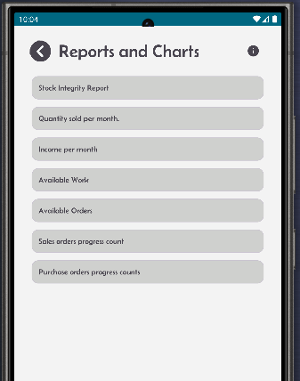
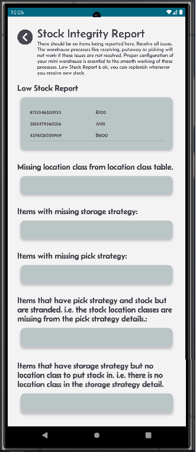
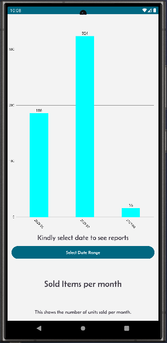
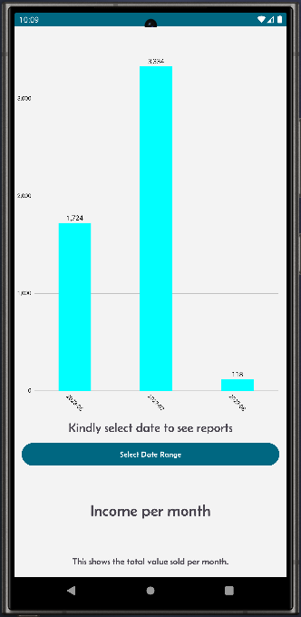
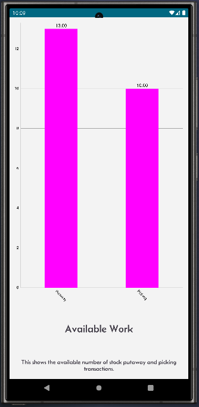
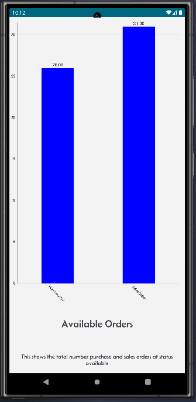
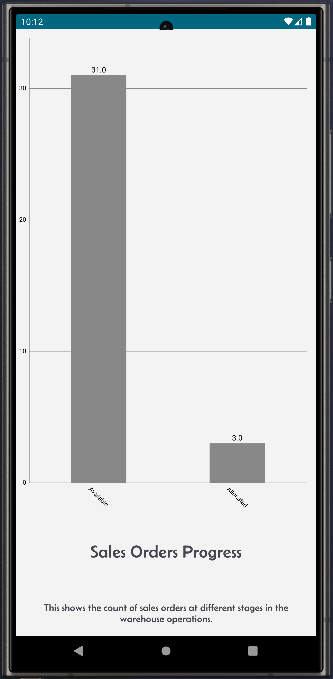
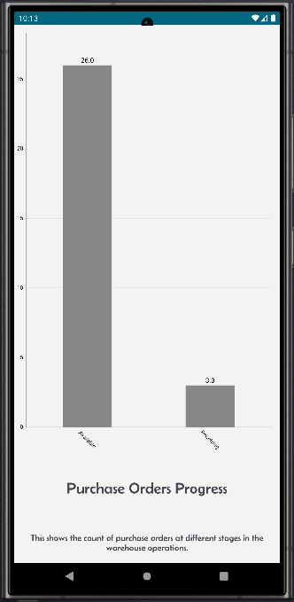

[← Back](README.md)

# Reporting Screen  

All reports are display only where no action is required.  
Except the Stock integrity report, where action needs to be taken to rectify all reported issues.  

### Stock integrity report:  
- There should be no items reported here. All items reported should be resolved immediately.  
- The warehouse processes like receiving, putaway, allocation or picking will not work if these issues are not resolved.  
- Proper configuration of your mini warehouse is essential for the smooth operation of these processes.  
- Low Stock Report is ok, you can replenish whenever you receive new stock.  

The rest of the reports are self explanatory.  

  
<table>
  <tr>
    <td style="width: 50%; text-align: left;">Available reports and charts.</td>
    <td style="width: 50%; text-align: left;">Stock intergity report.</td>
  </tr>
  <tr>
    <td style="vertical-align: top;">
      
    </td>
    <td style="vertical-align: top;">
      
    </td>
  </tr>
  <tr>
    <td style="width: 50%; text-align: left;">Slod items per month.</td>
    <td style="width: 50%; text-align: left;">Income per month.</td>
  </tr>
  <tr>
    <td style="vertical-align: top;">
      
    </td>
    <td style="vertical-align: top;">
      
    </td>
  </tr>
  <tr>
    <td style="width: 50%; text-align: left;">Available pick and putaway work.</td>
    <td style="width: 50%; text-align: left;">Available sales and purchase orders.</td>
  </tr>
  <tr>
    <td style="vertical-align: top;">
      
    </td>
    <td style="vertical-align: top;">
      
    </td>
  </tr>
  <tr>
    <td style="width: 50%; text-align: left;">Sales order progress by status.</td>
    <td style="width: 50%; text-align: left;">Purchase order progress by status.</td>
  </tr>
  <tr>
    <td style="vertical-align: top;">
      
    </td>
    <td style="vertical-align: top;">
      
    </td>
  </tr>
</table>
