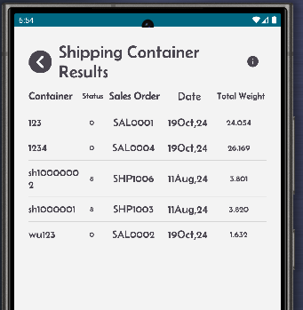
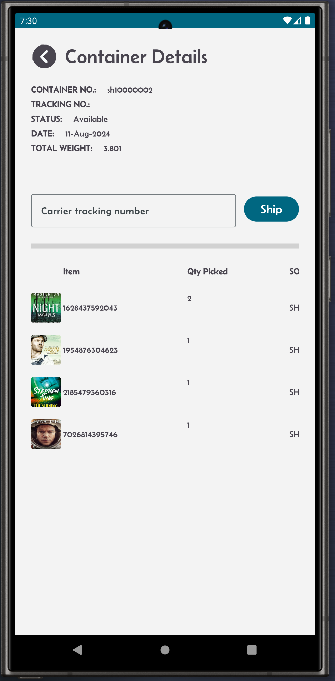
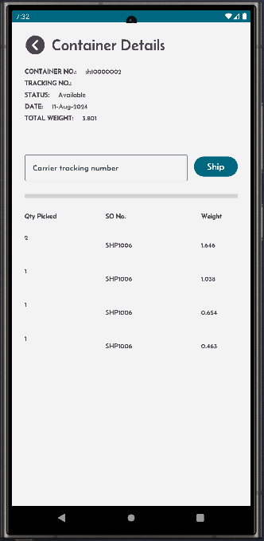
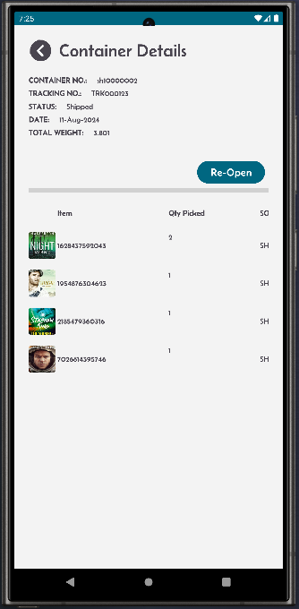

[← Back](README.md)

# Reporting Screen  

The Shipping Container Screen provides an overview of containers used during the picking process. Here's how it works:

### Visibility of Picked Containers:  
- During the picking process, stock is placed into containers.
- These containers will be listed and visible on this screen.

### Review and Validation:  
- Users can view all containers and validate their contents.
- Ensure the container contents match the expected ship to name and address, items and quantities against the sales order

### Marking as Shipped:  
- Once the container is validated:
  - Add the tracking number for the container.
  - Mark the container as shipped.

This screen ensures seamless tracking of picked containers, streamlines the shipping process, and improves operational accuracy.

<table>
  <tr>
    <td style="width: 50%; text-align: left;">Screen showing existing containers results.</td>
    <td style="width: 50%; text-align: left;">Screen showing container details.</td>
  </tr>
  <tr>
    <td style="vertical-align: top;">
      
    </td>
    <td style="vertical-align: top;">
      
    </td>
  </tr>
    <tr>
    <td style="width: 50%; text-align: left;">Validate the container weight.</td>
    <td style="width: 50%; text-align: left;">After aquiring a tracking number for your container, add it in this screen and click the Ship button, the status will change to Shipped. You can click the "Re-Open" button to change the tracking number.</td>
  </tr>
  <tr>
    <td style="vertical-align: top;">
      
    </td>
    <td style="vertical-align: top;">
      
    </td>
  </tr>
</table>
