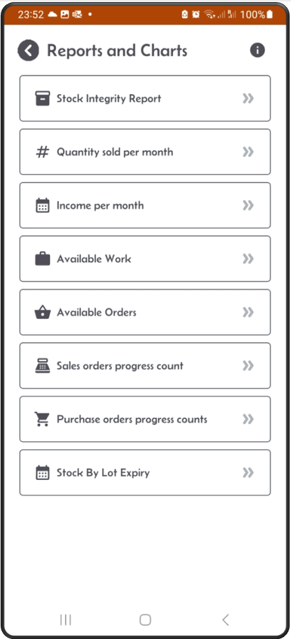
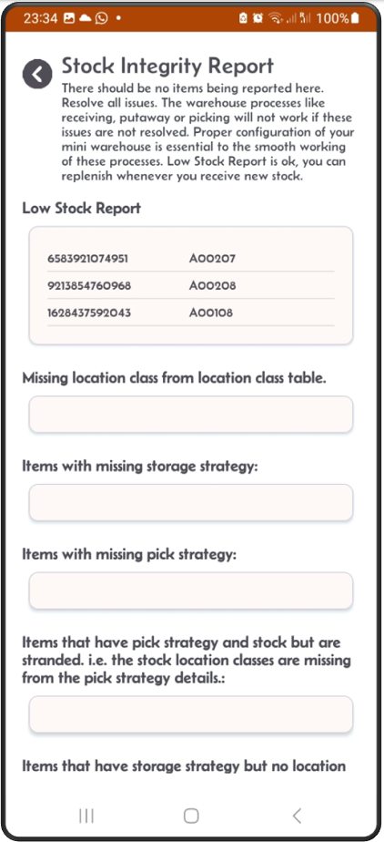
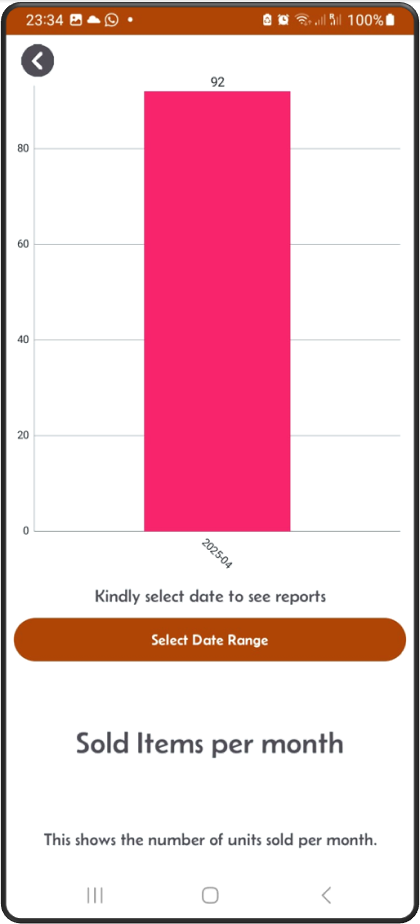
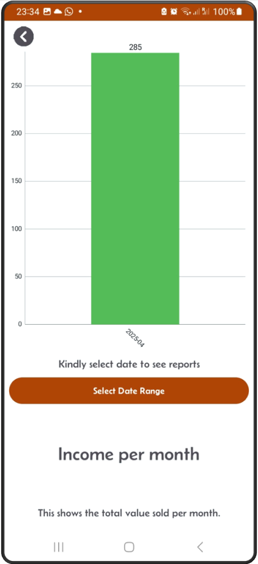
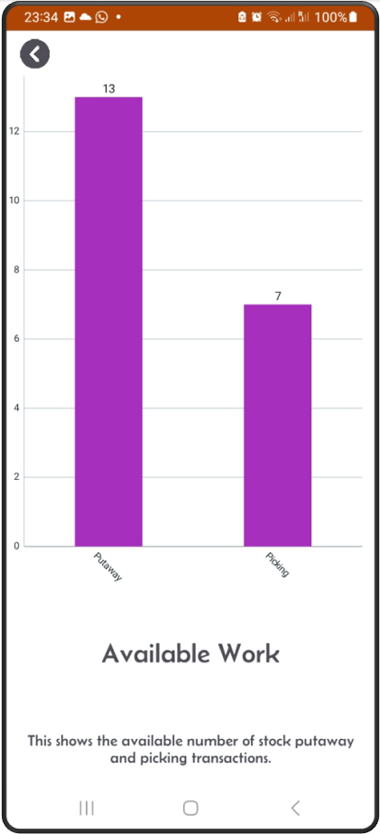
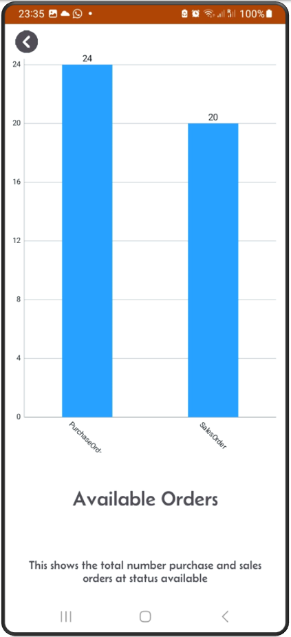
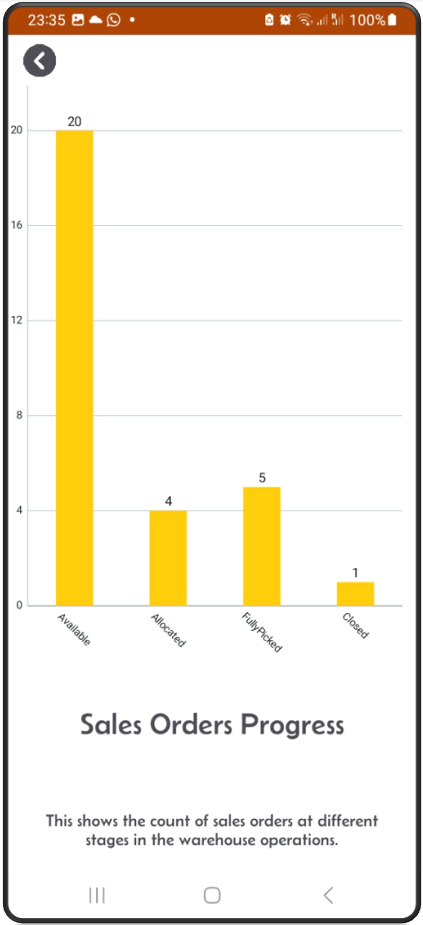
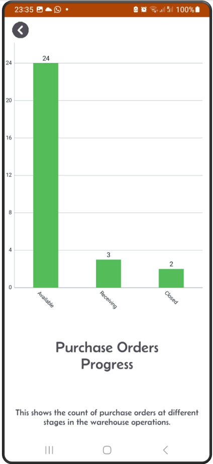
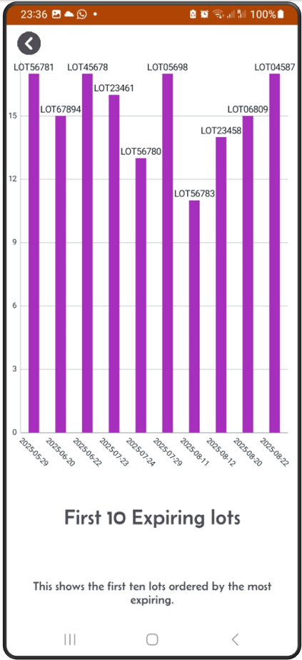

[← Back](README.md)

# Reporting Screen  

All reports are display only where no action is required.  
Except the Stock integrity report, where action needs to be taken to rectify all reported issues.  

### Stock integrity report:  
- There should be no items reported here. All items reported should be resolved immediately.  
- The warehouse processes like receiving, putaway, allocation or picking will not work if these issues are not resolved.  
- Proper configuration of your mini warehouse is essential for the smooth operation of these processes.  
- Low Stock Report is ok, you can replenish whenever you receive new stock.  

The rest of the reports are self explanatory.  

  
### ✅ Available reports and charts

Available reports and charts.  

---

### 📦 Stock integrity report

---

### 📊 Sold items per month
- By default it shows the current month.
- Change the date range for wider visibility.  

---

### 💰 Income per month
- By default it shows the current month.
- Change the date range for wider visibility.
  

---

### 🚚 Available pick and putaway work
 

---

### 🧾 Available sales and purchase orders
  

---

### 📈 Sales order progress by status
  

---

### 🛒 Purchase order progress by status
  

---

### ⏳ First 10 expiring lots

First 10 expiring lots.  

