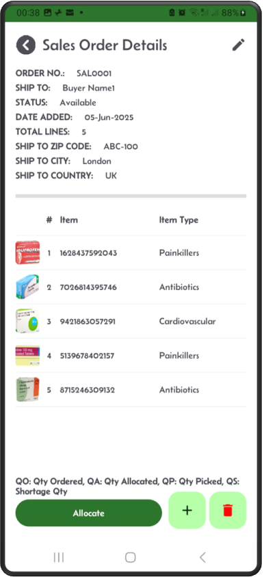
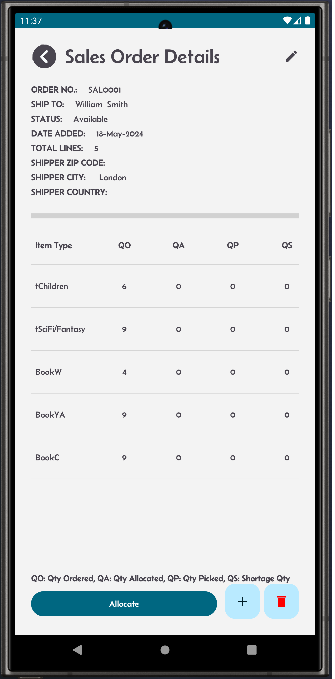
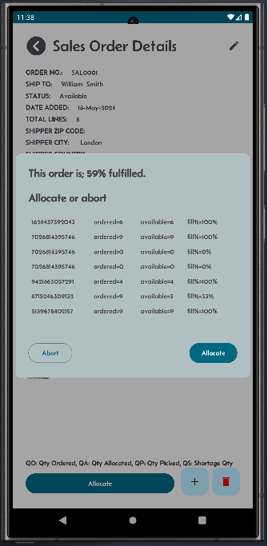
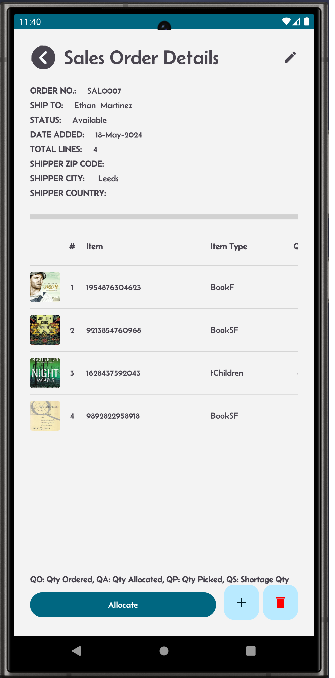
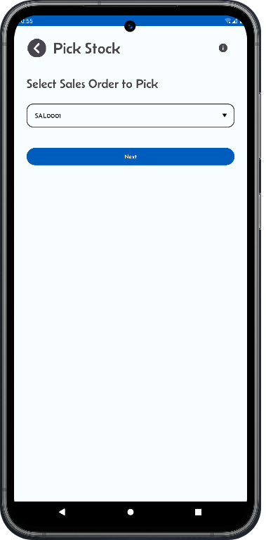
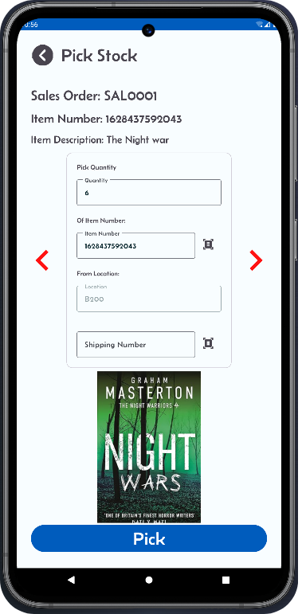
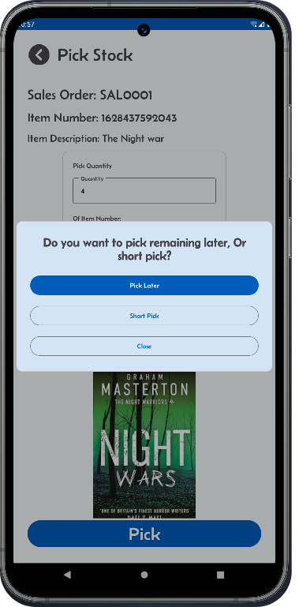

[← Back](README.md)

# Sales Order Allocation

Allocation of sales orders refers to the process of assigning available inventory to fulfill customer sales orders.  
It ensures that the required stock is reserved for specific orders, preventing overselling or double allocation of the same inventory.  

Mini-WMS allocation does support full or partial allocation:  
### Full allocation:  
When you click Allocate button, Mini-WMS is able to reserve stock for all the sales order lines, and generate all picking work.  
When you clikc Allocate button, Mini-WMS is not able to fullfill all the sales order lines. So, you can Allocate again when stock is replenished.  

### Key Components of Allocation in Mini-WMS:

**Inventory Reservation:**
- Allocating specific quantities of stock from available inventory to meet the demand in sales orders.
- Reserved inventory is marked and cannot be used for other orders until it is deallocated or fulfilled.

**Allocation Rules:**  
Mini-WMS allocation follows predefined rules or strategies, such as:
- FIFO (First-In-First-Out): Assign the oldest stock first.
- FEFO (First-Expired-First-Out): Allocate stock based on expiration dates.
- Location Priority: Allocate items from preferred locations (e.g., pick zones location class).
- Batch or Lot Priority: Allocate based on batch/lot numbers.

**Stock Availability Check:**  
- The system checks real-time stock availability in the warehouse to determine if items can be allocated for each sales order.

**Partial or Full Allocation:** 
- Full Allocation: All items and quantities in the sales order are allocated.
- Partial Allocation: Only part of the order is allocated if there is insufficient stock.

**Allocation vs. Picking:** 
- Allocation is the planning phase, where inventory is assigned to orders.
- Picking is the execution phase, where the assigned inventory is physically picked from the warehouse to fulfill the allocated orders.

The system checks real-time stock availability in the warehouse to determine if items can be allocated for each sales order.

<table>
  <tr>
    <td style="width: 50%; text-align: left;">View the sales order you want to allocate.</td>
    <td style="width: 50%; text-align: left;">Check the quantity ordered.</td>
  </tr>
  <tr>
    <td style="vertical-align: top;">
      
    </td>
    <td style="vertical-align: top;">
      
    </td>
  </tr>
  <tr>
    <td style="width: 50%; text-align: left;">After you click on Allocate button, a popup shows the quantity purcentage allocated. You have the choice to abort or continue.</td>
    <td style="width: 50%; text-align: left;">Screen to update existing vendor.</td>
  </tr>
  <tr>
    <td style="vertical-align: top;">
      
    </td>
    <td style="vertical-align: top;">
      
    </td>
  </tr>
</table>

**Mini-WMS supports Partial or Full Allocation:**
- Full Allocation: All items and quantities in the sales order are allocated.
- Partial Allocation: Only part of the order is allocated if there is insufficient stock.

**Allocation vs. Picking:**
- Allocation is the planning phase, where inventory is assigned to orders.
- Picking is the execution phase, where the assigned inventory is physically picked from the warehouse to fulfill the allocated orders.

## Picking Process

### Step 1: PO ready for picking
Verify your sales order is in the dropdown list.  

### Step 2: Picking from a location
The Mini-WMS app will automatically know which location the item will be picked from. The operator will go straight to the shown location on the picking screen.  
You can scan the item number and shipping container or enter them manually. Click on the **Pick** button, then take the stock from the location into the container.  

### Step 3: Short pick
You can pick less than the required quantity. The app will ask you to confirm:  
1. Do you want to pick the remaining quantity later?  
2. Or do you want to short pick the remaining quantity?  

