[← Back](README.md)

# Sales Order Allocation

Allocation of sales orders refers to the process of assigning available inventory to fulfill customer sales orders.  
It ensures that the required stock is reserved for specific orders, preventing overselling or double allocation of the same inventory.  

Mini-WMS allocation does support full or partial allocation:  
### Full allocation:  
When you click Allocate button, Mini-WMS is able to reserve stock for all the sales order lines, and generate all picking work.  
When you clikc Allocate button, Mini-WMS is not able to fullfill all the sales order lines. So, you can Allocate again when stock is replenished.  

### Key Components of Allocation in Mini-WMS:

**Inventory Reservation:**
- Allocating specific quantities of stock from available inventory to meet the demand in sales orders.
- Reserved inventory is marked and cannot be used for other orders until it is deallocated or fulfilled.

**Allocation Rules:**  
Mini-WMS allocation follows predefined rules or strategies, such as:
- FIFO (First-In-First-Out): Assign the oldest stock first.
- FEFO (First-Expired-First-Out): Allocate stock based on expiration dates.
- Location Priority: Allocate items from preferred locations (e.g., pick zones location class).
- Batch or Lot Priority: Allocate based on batch/lot numbers.

**Stock Availability Check:**  
- The system checks real-time stock availability in the warehouse to determine if items can be allocated for each sales order.

**Single order or group of orders Allocation:**
- Navigate to a single sales order and click the 'Allocate' button.
- Navigate to the sales order result screen and click the 'Allocate' button. Specify the date range. This will allocate all orders within that range.
  
**Partial or Full Allocation:** 
- Full Allocation: All items and quantities in the sales order are allocated.
- Partial Allocation: Only part of the order is allocated if there is insufficient stock.

**Allocation vs. Picking:** 
- Allocation is the planning phase, where inventory is assigned to orders.
- Picking is the execution phase, where the assigned inventory is physically picked from the warehouse to fulfill the allocated orders.

The system checks real-time stock availability in the warehouse to determine if items can be allocated for each sales order.

### Sales Order Allocation Workflow

---

**Step 1:** View the sales order you want to allocate  

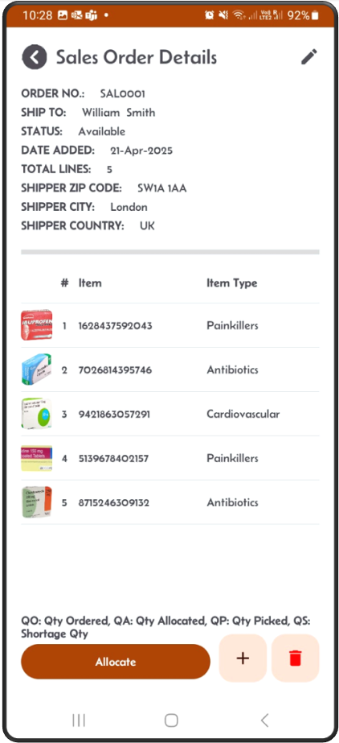

---

**Step 2:** Check the quantity ordered  

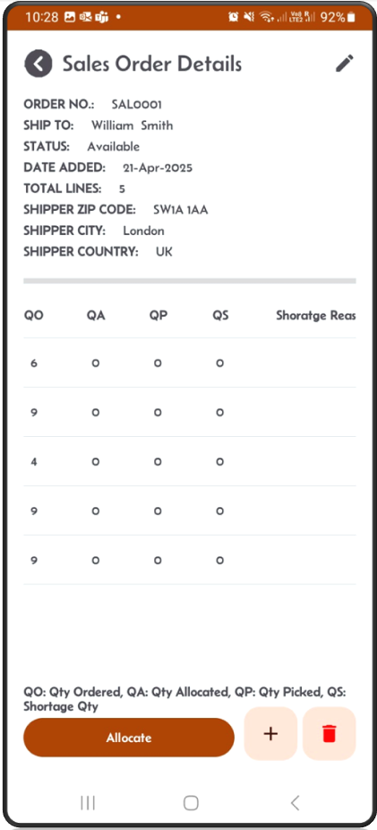

---

**Step 3:** With Sales order `SAL0001`, after clicking on the **Allocate** button, a popup shows the percentage of quantity allocated.  
In this case, not all stock can be fully allocated. You have the choice to abort or continue.  

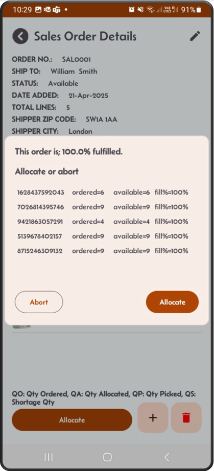

---

**Step 4:** The status changed to **Allocated**  

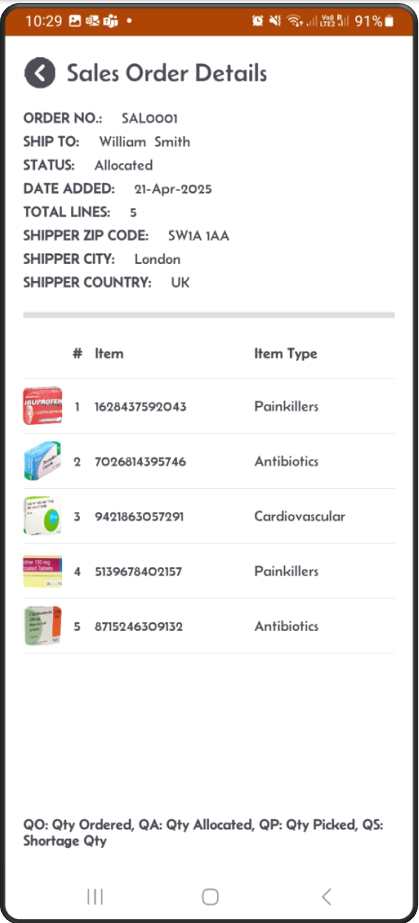

---

**Step 5:** Scroll to the right, you should see all lines are allocated. Quantity allocated is now equal to quantity ordered.  

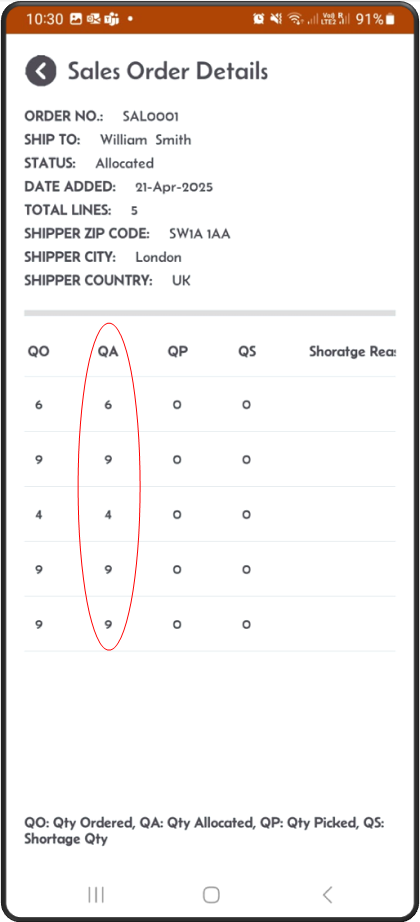

---

**Step 6:** Go back to the result screen, you can see that the status is set to 3 i.e. allocated and the wave number is set to 1.  
The wave number is a unique number generated and increment during each allocation.  

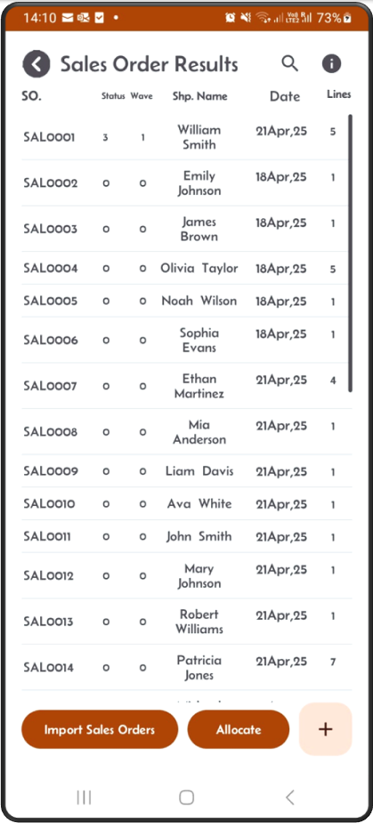

---

**Step 7:** You can Also allocate multiple orders at once  
Here we are going to allocate 5 orders at once. They all have the date time added as the 18Apr2025.  

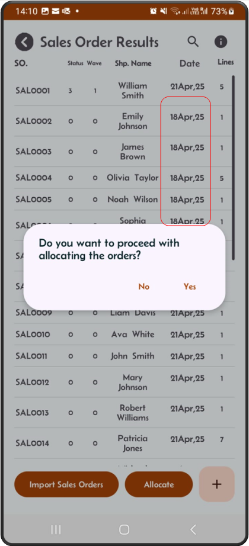

---

**Step 8:** Select the date range that includes the 18th Apr 2025, and click the **Allocate** button  

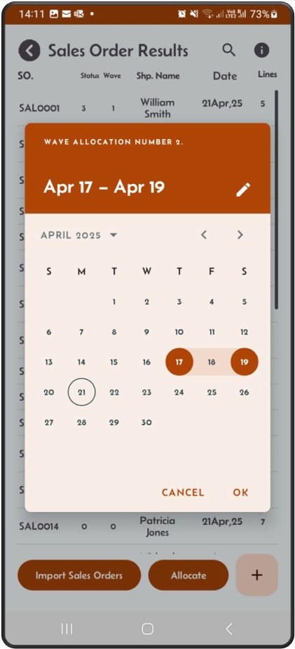

---

**Step 9:** For every order, a popup shows the percentage filled and asks you to 'Allocate' or 'Abort' the order.  

  
  
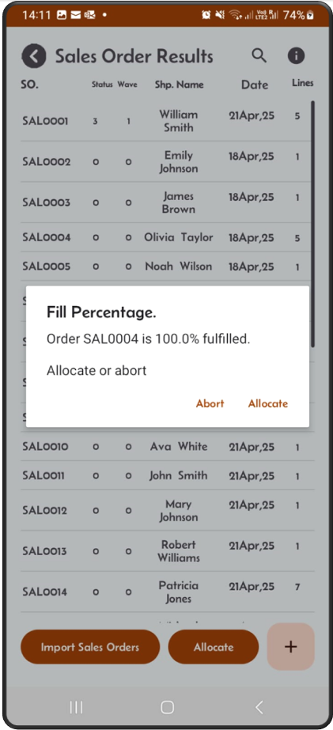  
  
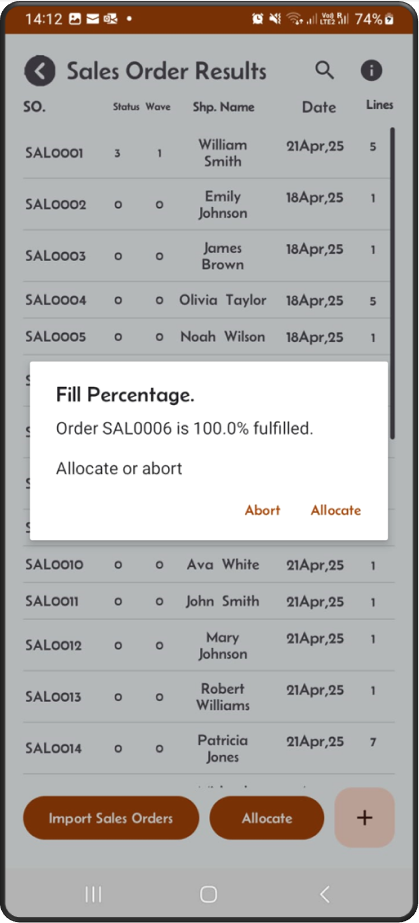  

---

**Step 10:** Once the allocation finishes, it takes you back to the result screen. 
You can now see that the 5 orders are allocated (status 3) and wave number is 2.  

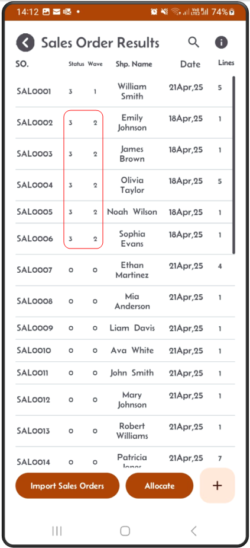

---

**Step 11:** From the main menu, click on the **Pick Stock** button. 
On the **Pick Stock** screen, the dropdown should now show that work is available for the five orders you have just allocated.  

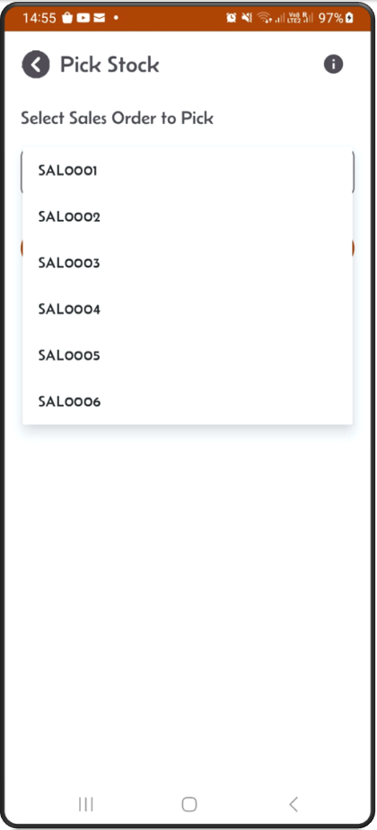
