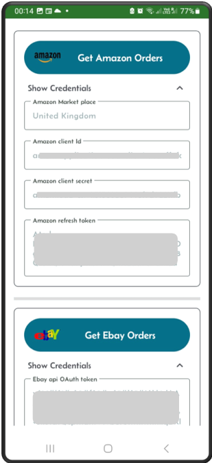
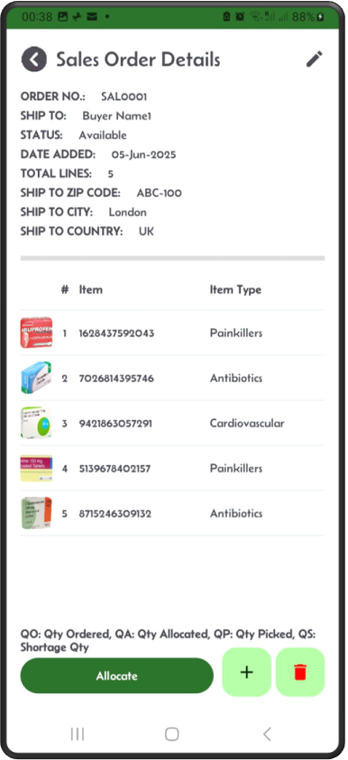
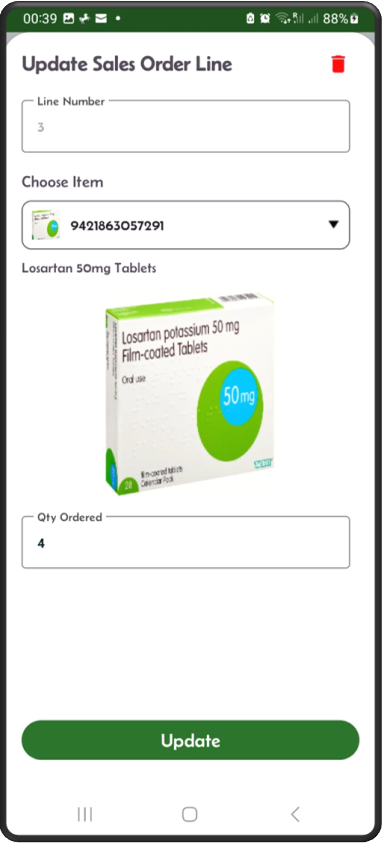

[← Back](README.md)

# Sales orders.

Sales orders in your Mini-WMS can be managed through multiple methods:
* They can be automatically pulled from your Shopify, Amazon, or eBay shops via API calls.
* Imported from an Excel spreadsheet.
* Added manually via the sales order add screen.

**Shopify API Integration**, Requires:  
- Your Shopify store URL.  
- Your Shopify API access token.  

**Amazon API Integration**, Requires:  
- Your Amazon marketplace.  
- Amazon client ID.  
- Amazon client secret.  
- Amazon refresh token.  

**eBay API Integration**, Requires:  
- Your eBay API OAuth token.  

**Excel Import**:  
- You need to fill in two sheets:  
  - One for sales order headers.  
  - One for sales order details.  
    
Each method provides flexibility to suit your operational needs and streamline sales order processing.

### Import Sales Orders  

**Step 1:** Import sales orders via multiple ways  

---

**Step 2:** This requires credentials to access Shopify  

---

**Step 3:** Amazon and eBay sites  

---

### Sales Order Management

---

**List of Sales Orders**  
This screen shows the list of sales orders.  

---

**Sales Order Details**  
Single sales order detail screen showing header and detail lines.  

---

**Update Sales Order Line**  
This screen allows you to update a specific sales order line by taping on a line number.  

---

**Update Sales Order Header**  
You can update sales order header information here.  

---

**Add Sales Order - Header**  
This is the screen to add a new sales order (header section).  

---

**Add Sales Order - Line**  
Continue to add lines to the sales order.  

