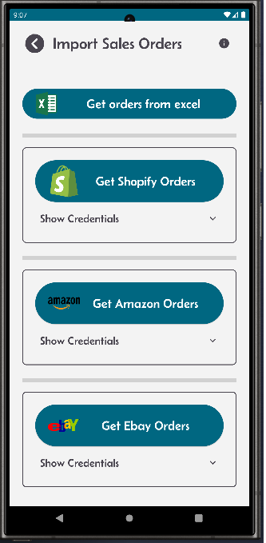
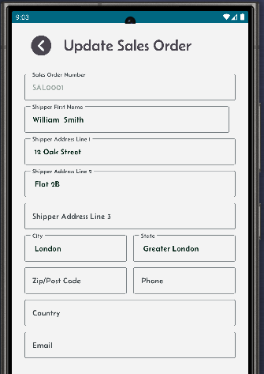

[← Back](miniWMSConfiguration.md)

# Sales orders.

Sales orders in your Mini-WMS can be managed through multiple methods. They can be automatically pulled from your Shopify, Amazon, or eBay shops, imported from an Excel spreadsheet, or added manually via the sales order screen.

Shopify Integration: Requires:
  - Your Shopify store URL.
  - You hopify API access token.  

Amazon Integration Requires:
  - Your Amazon marketplace.
  - Amazon client ID.
  - Amazon client secret.
  - Amazon refresh token.
    
eBay Integration Requires:
  - Your eBay API OAuth token.
    
Excel Import Requires:
  - You to fill in two sheets — one for sales order headers and one for sales order details.
    
Each method provides flexibility to suit your operational needs and streamline sales order processing.

<table>
  <tr>
    <th>Import sales orders via multiple ways.</th>
    <th>This requires credentials to access Shopify.</th>
    <th>Amazon and Ebay sites.</th>
  </tr>
  <tr>
    <td style="vertical-align: top;">
      
    </td>
    <td style="vertical-align: top;">
      
    </td>
    <td style="vertical-align: top;">
      
    </td>
  </tr>
    <tr>
    <th>List of sales orders screen.</th>
    <th>Single sales order detail screen showing header and detail lines.</th>
    <th>Update screen for a sales order.</th>
  </tr>
  <tr>
    <td style="vertical-align: top;">
      
    </td>
    <td style="vertical-align: top;">
      
    </td>
    <td style="vertical-align: top;">
      
    </td>
  </tr>
    </tr>
    <tr>
    <th colspan="2">Sales order add screen.</th>
  </tr>
  <tr>
    <td style="vertical-align: top;">
      
    </td>
    <td style="vertical-align: top;">
      
    </td>
  </tr>
</table>
