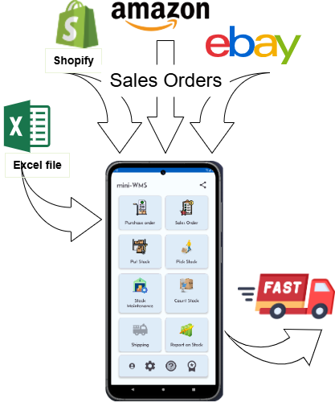

[← Back](README.md)

# Sales orders download.

Sales orders in your Mini-WMS can be managed through multiple methods. They can be automatically pulled from your Shopify, Amazon, or eBay shops. As well as imported from an Excel spreadsheet, or added manually via the sales order screen.



**Shopify Integration**: Requires:  
- Your Shopify store URL.  
- Your Shopify API access token.  
🚨 **Important:** To successfully import the orders with their items, the Shopify SKU must match the item number in your mini-WMS app.  
🚨 **Important:** To successfully import the buyer's name and shipping address, you need to be on the **Advance** or **Plus** plan. If not, Shopify will only send you the country name.

**Amazon Integration**: Requires:  
- Your Amazon marketplace.  
- Amazon client ID.  
- Amazon client secret.  
- Amazon refresh token.  
🚨 **Important:** To successfully import the orders with their items, you need to have the Amazon SellerSKU field on Amazon, the same as the item number in your mini-WMS app.

**eBay Integration**: Requires:  
- Your eBay API OAuth token.  
🚨 **Important:** To successfully import the orders with their items you need to have the Ebay SKU field, when you setup each product in Ebay, the same as the item number in your mini-WMS app.

# **Excel Import**:  
- You need to fill in two sheets:  
  - One for sales order headers.  
  - One for sales order details.  
    
Each method provides flexibility to suit your operational needs and streamline sales order processing.

To import sales orders via excel, click on the "Get Orders from excel" button and upload your Excel spreadsheet.
The spreadsheet should consist of two sheets: "salesorder" and "salesorderline". The import process will look for these sheet names with exact spelling.
So it needs to be written as they are. Below are the excel sheets and their columns.

The salesorder spreadsheet columns should contain the first row as the column names of the sales order header fields, then, in the next rows the header information, as shown below:
In this case we have shown 2 orders. You can have as many as you like.

```
"salesorder"
so_num    ship_to_name    ship_addr1    ship_Addr2     ship_addr3  ship_city  ship_state  ship_zippostcode  country  ship_phone     ship_email
SAL0001   John Doe        123 Main St   Suite 200                  New York   NY          10001             USA      555-123-4567   john.doe@example.com
SAL0002   Jane Smith      456 Elm St    Apt 5B                     Chicago    IL          60614             USA      555-987-6543   jane.smith@example.com
```

The salesorderline spreadsheet columns should contain the first row as the column names of the sales order detail fields, then, in the next rows the details information, as shown below:

```
"salesorderline"
so_num    line_num      itm_num          qty_ordered
SAL0001	    1	        1628437592043	    6
SAL0001	    2	        7026814395746	    9
SAL0001	    3	        9421863057291	    4
SAL0001	    4	        5139678402157	    9
SAL0001	    5	        8715246309132	    9
SAL0002	    1	        1402863754296	    2
SAL0002	    2	        7953140862754	    7
SAL0002	    3	        2185479360316	    10
```
