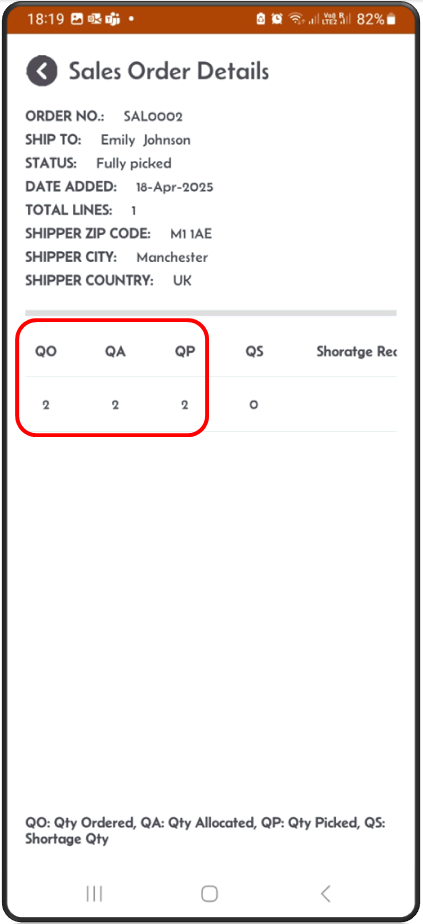

[← Back](README.md)

# Shipping Container Screen  

The Shipping Container Screen provides an overview of containers used during the picking process. Here's how it works:

### Visibility of Picked Containers:  
- During the picking process, stock is placed into containers.
- These containers will be listed and visible on this screen.

### Review and Validation:  
- Users can view all containers and validate their contents.
- Ensure the container contents match the expected ship to name and address, items and quantities against the sales order

### Marking as Shipped:  
- Once the container is validated:
  - Add the tracking number for the container.
  - Mark the container as shipped.

This screen ensures seamless tracking of picked containers, streamlines the shipping process, and improves operational accuracy.

### Container Management:  
- From the main screen, click on the **Shipping** button to access the shipping container results screen.
---

**Step 1:** Screen showing existing containers.  

---

**Step 2:** From the Results screen, tap one container.  
- A screen showing container details will appear.  
- This will show the container status, Total weight and the ship to name & address.  

---

**Step 3:** Validate the container weight.  
The toal weight should be the sum of all the details' weight.

---

**Step 4:** After acquiring a tracking number (from the carrier), 
- enter it or scan it on this screen and click the **Ship** button.  
- The status will change from Available to **Shipped**.  
- You can also click **Re-Open** to update the tracking number.  

---

**Step 5:** After clicking the **Ship** button:  
- The status will change from Available to **Shipped**.  
- You can also click **Re-Open** to update the tracking number.  

---

### Sales order & Shipping container statuses  

Container status can go from:
- **Available**&nbsp;&nbsp;&nbsp;: Status 0  
- **Shipped**&nbsp;&nbsp;&nbsp;&nbsp;: Status 8  (Tracking number is populated and **Ship** button clicked)

Sales Order status can go from:  
- **Available**&nbsp;&nbsp;&nbsp;: Status 0.    (Not allocated)
- **Allocated**&nbsp;&nbsp;&nbsp;: Status 3.    (Allocated)
- **Fully Picked**: Status 7.    (All picking work completed)
    - **Picked into container** should be at status **Available** i.e. status 0.
- **Closed**&nbsp;&nbsp;&nbsp;&nbsp;&nbsp;&nbsp;:  Status 8.   ( If the container is **Ship** )
    - **Picked into container** should be at status **Available** i.e. status 0.

  
  
  
  
  
