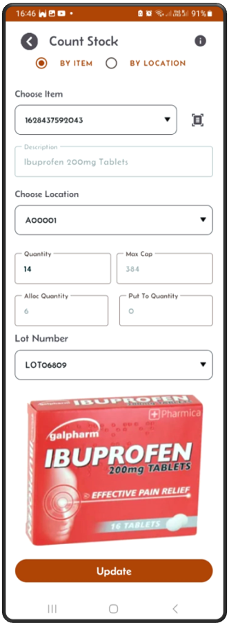
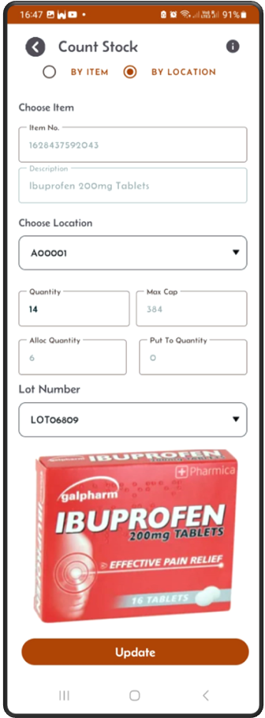

[← Back](README.md)

# Stock Count Screen  
To perform a stock count, follow these steps:  

### Access the Stock Count Screen  
Click the "Stock Count" button on the main screen.  

### Counting Options  
- You can count stock by selecting either:  
    - By Item: Click on the Item radio button, and choose a specific item from the **dropdown** or use the **barcode scanner** to load the itemloc details, then update the quantity if neccesary.  
    - By Location: Click on the Location radio button, and choose specific location from the dropdown locations to load the itemloc details, then update the quantity if neccesary.  

### Update Stock  
- Once you select a location, the screen will display:  
    - The item stored in that location.
    - If the item exists in multiple locations, then the location dropdown should show all the locations where this item exists.
    - The quantity currently recorded in Mini-WMS.  
- If your physical count differs, you can update the system with the correct quantity.
- Any location can hold only one item, Mini-WMS does not handle item-mixing.
  
Stock counting ensures your inventory data remains accurate, improving stock management and operational efficiency.  

### Stock Count Search Options

---

**Option 1:** Searching stock by item and update if necessary. Use **barcode scanner** if needed.  
* If the item is lot controlled (Check the item screen, the lot control flag should be set).
* And if there are multiple lot numbers in the itemloc, then all those lots should be seen in the lot dropdown.
* Select from the lot dropdown to update each lot.  

---

**Option 2:** Searching stock by location and update if necessary. Use **barcode scanner** if needed.  
* If the item is lot controlled (Check the item screen, the lot control flag should be set).  
* And if there are multiple lot numbers in the itemloc, then all those lots should be seen in the lot dropdown.  
* Select from the lot dropdown to update each lot.  

