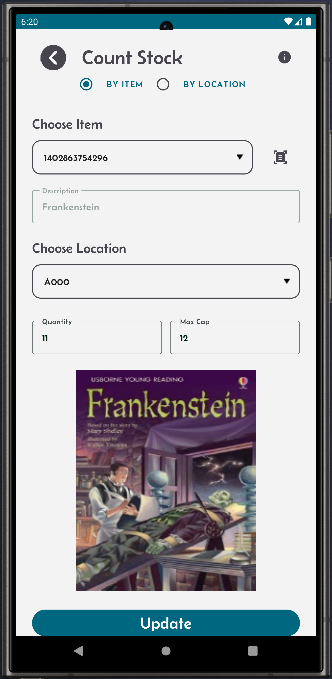
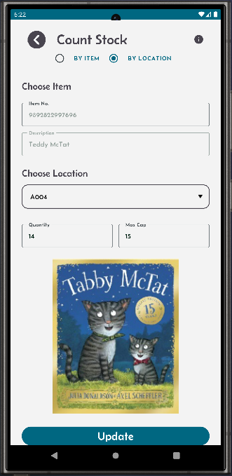

[← Back](README.md)

# Stock count  

# Stock Count Screen  
To perform a stock count, follow these steps:  

### Access the Stock Count Screen  
Click the "Stock Count" button on the main screen.  

### Counting Options  
- You can count stock by selecting either:  
    - Item: Choose a specific item to count across all locations.  
    - Location: Go to a specific location and select it on the screen.  

### Update Stock  
- Once you select a location, the screen will display:  
    - The item(s) stored in that location.  
    - The quantity currently recorded in Mini-WMS.  
- If your physical count differs, you can update the system with the correct quantity.  
  
Stock counting ensures your inventory data remains accurate, improving stock management and operational efficiency.  

<table>
  <tr>
    <td style="width: 50%; text-align: left;">Searching stock by item.</td>
    <td style="width: 50%; text-align: left;">Searching stock by location</td>
  </tr>
  <tr>
    <td style="vertical-align: top;">
      
    </td>
    <td style="vertical-align: top;">
      
    </td>
  </tr>
</table>
