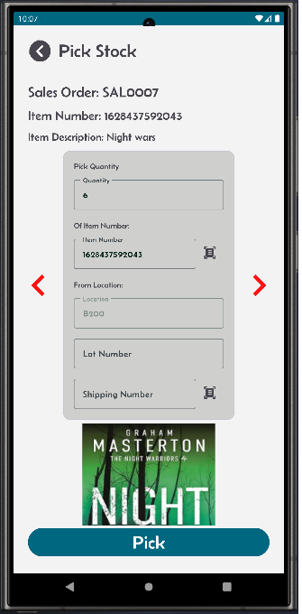
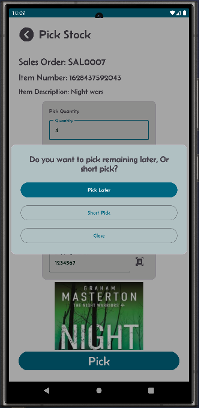

[← Back](miniWMSConfiguration.md)

# Storage Strategy Configuration

Storage strategies are essential in the WMS receiving process, particularly when combined with well-defined location classes. 

Incoming goods can be efficiently directed to the most suitable group of locations, ensuring that items are stored in optimal conditions based on their specific needs.

This approach helps:

- Simplify the receiving process, resulting in more effective warehouse operations and improved accuracy in stock management.
- Minimize handling time.
- Maximize space utilization.

  

<table>
  <tr>
    <td style="width: 50%; text-align: left;">Step 1: PO ready for picking</td>
    <td style="width: 50%; text-align: left;">Step 2: Picking from a location. If the item is lot control, you have to provide lot control.</td>
  </tr>
  <tr>
    <td style="vertical-align: top;">
      
    </td>
    <td style="vertical-align: top;">
      
    </td>
  </tr>
  <tr>
    <td style="width: 50%; text-align: left;">You can pick some and some later. Or short pick some quantities or zero pick all.</td>
    <td style="width: 50%; text-align: left;">If the item is serial number control, then you have to enter a serial number for every each.</td>
  </tr>
  <tr>
    <td style="vertical-align: top;">
      
    </td>
    <td style="vertical-align: top;">
      
    </td>
  </tr>

