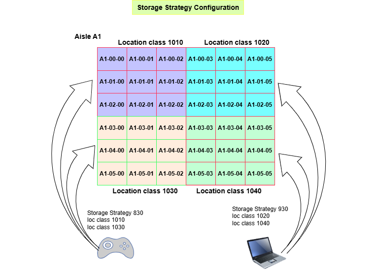
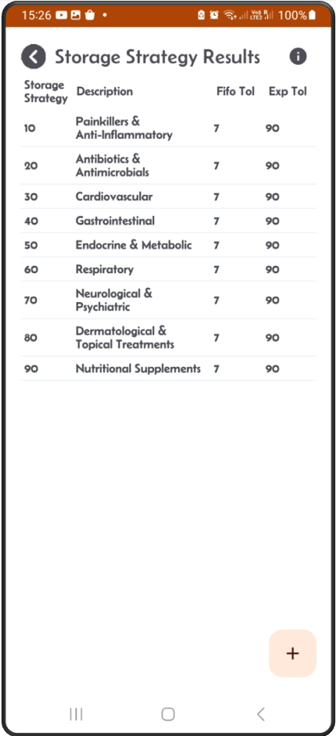
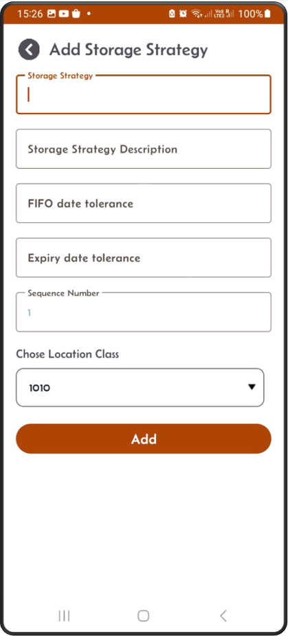
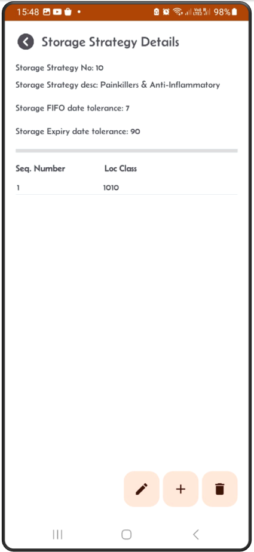
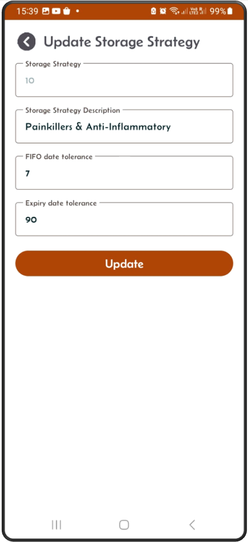
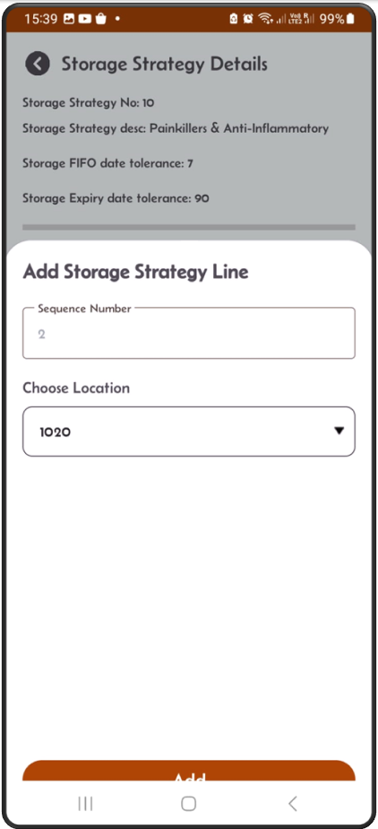
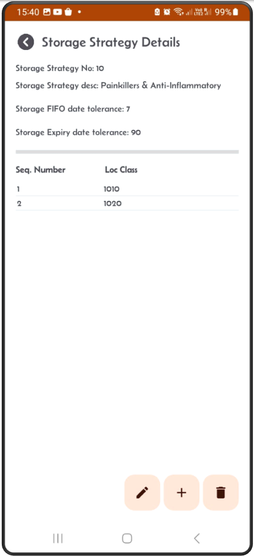
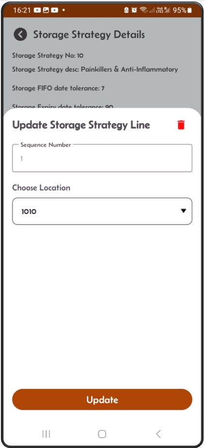

[← Back](miniWMSConfiguration.md)

# Storage Strategy Configuration

Storage strategies are essential in the WMS receiving process, particularly when combined with well-defined location classes. 

Incoming goods can be efficiently directed to the most suitable group of locations, ensuring that items are stored in the best suited locations based on their specific needs.

This approach helps:

- Simplify the receiving process, resulting in more effective warehouse operations and improved accuracy in stock storage.
- Minimize handling time.
- Maximize space utilization.

  

### Storage Strategy Workflow

---

**Step 1:** This is the storage strategy result screen.  

---

**Step 2:** Click the + button to add a new storage strategy.  
Add description, FIFO and expiry tolerance values, then location class details.  

---

**Step 3:** When you click **Add** button the new storage strategy will appear on the **Details** screen.  

---

**Step 4:** Click on the pen button to edit the storage strategy header information.  

---

**Step 5:** From the detail screen, click the + button to add a new location class detail.  

---

**Step 6:** The new location class will appear on the Details screen.  

---

**Step 5:** On the detail screen, click on an existing location class.  
You can either edit it, or click the red delete button to remove it.  

