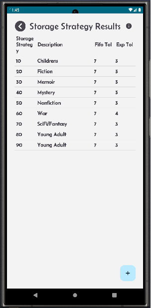
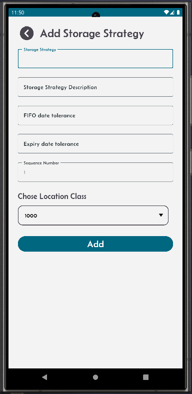
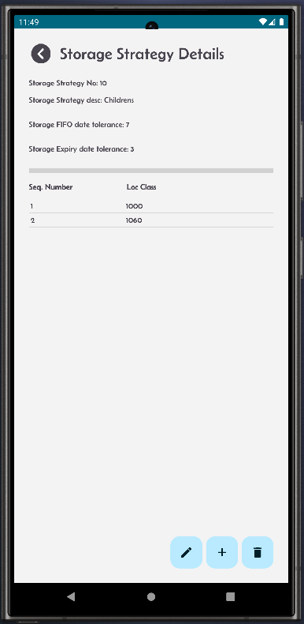
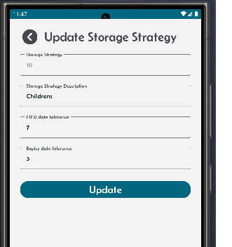
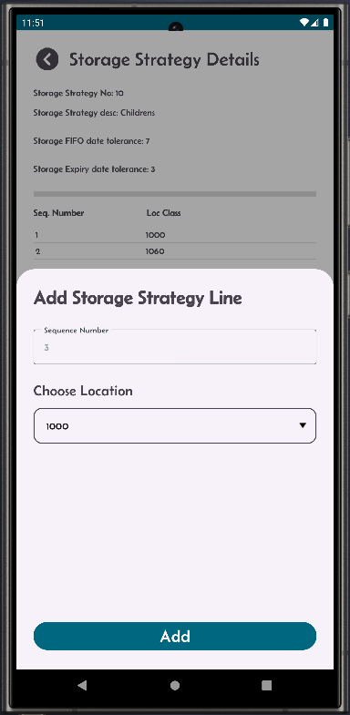
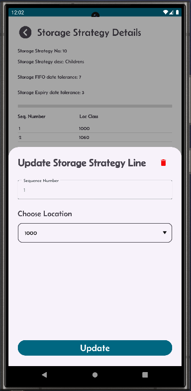

[← Back](miniWMSConfiguration.md)

# Storage Strategy Configuration

Storage strategies are essential in the WMS receiving process, particularly when combined with well-defined location classes. 

Incoming goods can be efficiently directed to the most suitable group of locations, ensuring that items are stored in optimal conditions based on their specific needs.

This approach helps:

- Simplify the receiving process, resulting in more effective warehouse operations and improved accuracy in stock management.
- Minimize handling time.
- Maximize space utilization.

  

<table>
  <tr>
    <td style="width: 50%; text-align: left;">This is the storage strategy result screen.</td>
    <td style="width: 50%; text-align: left;">Click the + button and you should be able to add new storage strategy. Add description, fifo and expiry tolerance values Then the location class details.</td>
  </tr>
  <tr>
    <td style="vertical-align: top;">
      
    </td>
    <td style="vertical-align: top;">
      
    </td>
  </tr>
  <tr>
    <td style="width: 50%; text-align: left;">From the result screen, you can click on a record in the list which will take you to the storage strategy detail screen.</td>
    <td style="width: 50%; text-align: left;">Click on the pen button to edit the storage strategy header information.</td>
  </tr>
  <tr>
    <td style="vertical-align: top;">
      
    </td>
    <td style="vertical-align: top;">
      
    </td>
  </tr>
    <tr>
    <td style="width: 50%; text-align: left;">From the storage strategy detail screen, you can click on the + button, you should be able to add a new location class detail.</td>
    <td style="width: 50%; text-align: left;">From the storage strategy detail screen, you can click on an exising location class record to edit it. Alos, you can click the red delete button to remove the location class.</td>
  </tr>
  <tr>
    <td style="vertical-align: top;">
      
    </td>
    <td style="vertical-align: top;">
      
    </td>
  </tr>
</table>
